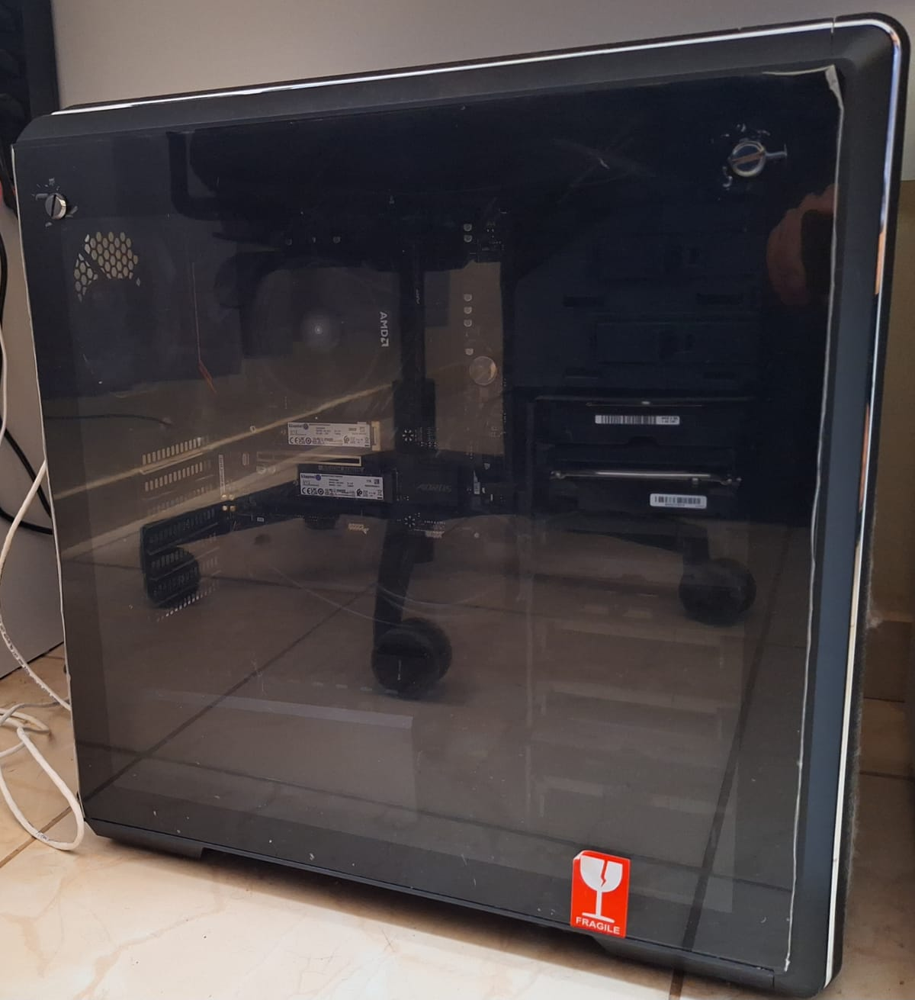

---


Descrevo as especificações do meu segundo servidor. Ao contrário do [meu primeiro, o Synology DS420j](https://www.marcal.dev/homelab-synology-ds420j/), que é um sistema fechado pronto para uso e sem possibilidade de upgrade, decidi montar um por conta própria para ter mais flexibilidade no futuro. Desde Julho de 2023, o servidor está rodando estável com as seguintes configurações:

### Software

*   **Sitema Operacional**: Ubuntu Server - última versão estável, instalado em um SSD de 500GB.
*   **Automação**: [Ansible](https://www.ansible.com/) para automação de configurações.
*   **Services**: Docker e docker-compose para rodar maioria das services.
*   **Sistema de arquivos**: Zed File System (ZFS).
*   **Pool de arquivos** do ZFS: dois HDs de 4TB em espelho e um SSD de 1TB para cache, totalizando um pool de aproximadamente 4TB.
*   **Snapshots automáticos**: nos volumes do pool de arquivos ZFS, cada volume do pool com sua configuração de tempo específico.

### Hardware

O valor ao lado de cada peça refere-se ao que paguei na época da compra. Nem tudo foi adquirido simultaneamente, como os HDs, que já possuía desde a compra do [Synology DS420j](https://www.marcal.dev/homelab-synology-ds420j/), ou a memória SSD de 1TB e outra memória de 32GB, que optei por adquirir posteriormente, após o servidor já estar em funcionamento por um tempo.

*   **Armazenamento para Sistema Operacional**: [Kingston SSD Nv2 500 GB M.2-2280](https://meupc.net/peca/A62Rhn/ssd-kingston-nv2-nv2500gb) , R$ 218,40
*   **Armazenamento de cache de arquivos**: [Armazenamento Kingston SSD Nv2 1 TB M.2-2280](https://meupc.net/peca/btX3J5/ssd-kingston-nv2-nv21tb) , R$ 292,00
*   **Armazenamento de arquivos 1**: [Disco rígido interno Western Digital WD Red WD40EFAX 4TB vermelho](https://www.mercadolivre.com.br/disco-rigido-interno-western-digital-wd-red-wd40efax-4tb-vermelho/p/MLB16085021?pdp_filters=item_id:MLB2098589911) , R$ 734,80
*   **Armazenamento de arquivos 2**: [Disco rígido interno Western Digital WD Red WD40EFAX 4TB vermelho](https://www.mercadolivre.com.br/disco-rigido-interno-western-digital-wd-red-wd40efax-4tb-vermelho/p/MLB16085021?pdp_filters=item_id:MLB2098589911) , R$ 734,80
*   **Memória**: [Kingston Fury Beast (Preto) 16 GB (1x16 GB) DDR4-3200](https://meupc.net/peca/mng99J/memoria-kingston-fury-beast-kf432c16bb16), R$ 241,50
*   **Memória**: [Kingston Fury Beast (Preto) 32 GB (1x32 GB) DDR4-3200](https://meupc.net/peca/bZeZ59/memoria-kingston-fury-beast-kf432c16bb32), R$ 500,00
*   **Processador**: [AMD Ryzen 5 5600G 3.9 GHz 6-Core](https://meupc.net/peca/da5cU3/processador-amd-ryzen-5-5600g-100100000252box), R$ 938,03
*   **Placa-mãe**: [Gigabyte B550M Aorus Elite Micro ATX AM4](https://meupc.net/peca/tao7S8/placa-mae-gigabyte-b550m-aorus-elite), R$ 888,88
*   **Fonte**: [Fonte de Alimentação Redragon RGPS-750W 80 Plus Gold](https://www.amazon.com.br/dp/B09V89JMY9), R$ 618,85
*   **Gabinete**: [Cooler Master MasterBox CM694 (Preto) ATX Mid Tower](https://meupc.net/peca/bfWx94/gabinete-cooler-master-masterbox-cm694-mcbcm694kg5n), R$ 922,82
*   **Total**: R$ 6090,08

### Gabinete

O gabinete foi difícil de encontrar, pois atualmente não é comum encontrar gabinetes com mais de duas baias à venda. Este me proporciona as seguintes possibilidades:

*   2x 5.25"
*   6x 3.5 " / 2.5“ (Combo - drive cages)
*   SSD 8x 2.5 ”(2+ 6 Combo)
*   Slots de expansão: 7

Pretendo utilizar a capacidade total, inserindo HDs de 4 a 6TB, na esperança de que os de 6TB se tornem mais acessíveis no futuro. Não considero isso exagerado, uma vez que, nos dias de hoje, é muito fácil gerar arquivos digitais, como fotos, músicas, documentos e filmes. Apenas o filme Interstellar ocupa 29,53 GB de espaço; claro, a maioria dos filmes e shows não ultrapassam 2 GB, mas alguns ainda merecem ser armazenados com melhor qualidade. Eis a minha capacidade no pool de arquivos, hoje, 05 de Fevereiro:

```shell
zpool list
NAME       SIZE  ALLOC   FREE  CKPOINT  EXPANDSZ   FRAG    CAP  DEDUP    HEALTH  ALTROOT
dataPool  3.62T  1.25T  2.37T        -         -     6%    34%  1.00x    ONLINE  -

```
