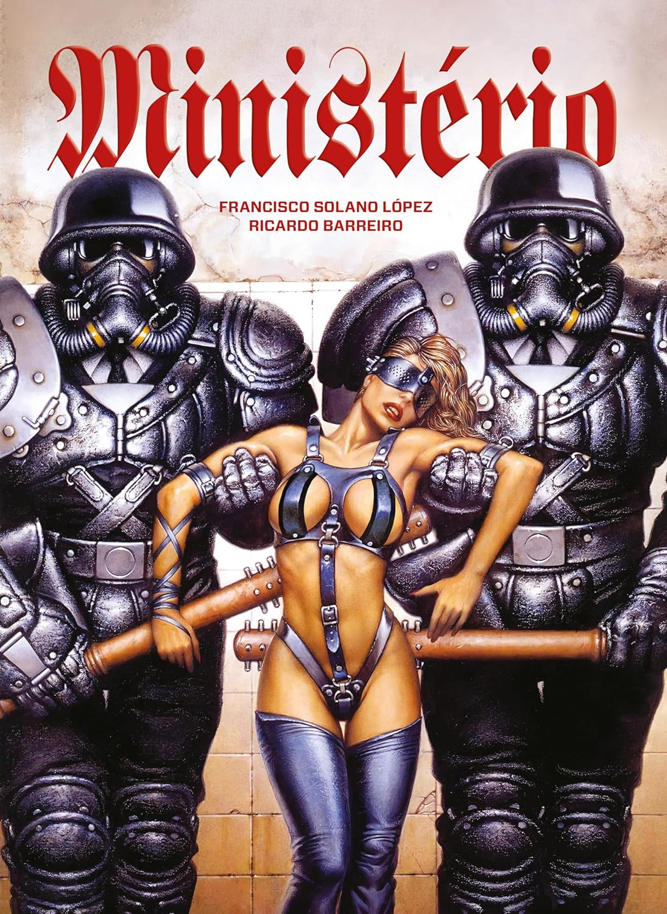

> Em um arranha-céus de cinco mil andares, a Hierarquia reina soberana sobre os funcionários que vivem, trabalham e morrem nos níveis inferiores do Ministério que administra o mundo. Assediados diariamente, sequestrados em massa para satisfazer os caprichos de uma casta intocável e utilizados como cobaias em experimentos genéticos, esses indivíduos nutrem secretamente a chama da revolta. Um deles, o jovem Carlos Pibe, resolve confrontar o sistema e embarca numa jornada em busca de sua amada, rumo aos andares superiores e inacessíveis do edifício, vigiados por um impiedoso Serviço de Segurança, cuja missão é defender os terríveis segredos que o Ministério esconde.
> Criado pelo renomado artista argentino Francisco Solano López (O Eternauta, Evaristo) em colaboração com seu compatriota Ricardo Barreiro (Cidade, Parque Chas), Ministério destaca-se como um dos mais brilhantes exemplos de distopia sociopolítica em quadrinhos. Esta edição reúne todos os capítulos da série, originalmente publicados entre 1986 e 1987 nas páginas da revista Fierro.
> A edição tem acabamento de luxo, com formato grande, capa dura, 96 páginas em preto e branco, impressas em papel offset de alta gramatura.

Esse eu ganhei de presente e foi uma escolha muito acertada, abrangendo diversos temas como ficção científica, distopia, fascismo e regimes autoritários.

Situada em uma sociedade fascista distópica após uma grande guerra mundial, esta é uma leitura breve, com eventos ocorrendo de maneira bastante acelerada, mas isso em nada diminui o valor desta Graphic Novel.

Algo que me chamou a atenção foi a caracterização dos guardas da SS, que eram seres geneticamente modificados, tendo como inspiração física o Super-Homem, e vestiam uniformes da SS nazista.

Devido à rapidez da narrativa, percebi que algumas explicações foram um tanto apressadas, carecendo de detalhes sobre o mundo, as formas de organização nos diferentes andares, a maneira de vida das elites nos andares superiores, entre outros aspectos.

Apesar disso, fiquei encantado com essa leitura!