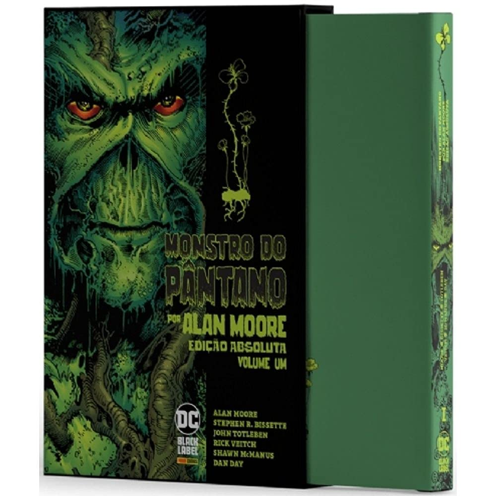

> De 1983 a 1987, um jovem escritor da Inglaterra juntou-se a um trio de desenhistas dos Estados Unidos para revitalizar uma lenda dos quadrinhos. Quatro anos depois, quando concluíram o trabalho, o MONSTRO DO PÂNTANO de Alan Moore, Stephen R. Bissette, John Totleben e Rick Veitch era universalmente reconhecido como um dos títulos que redefiniu os quadrinhos adultos e trouxe toda uma nova abordagem repleta de complexidade se tornando uma grande influência até os dias de hoje. Este primeiro volume inclui THE SAGA OF THE SWAMP THING 20 a 34 e SWAMP THING ANNUAL 2, trazendo um monumental novo posfácio de Stephen Bissette, acompanhado de um rico e histórico compilado de ilustrações e imagens de produção da equipe criativa! Edição de colecionador, com caixa para acondicionar esta que é uma das obras-primas das HQs!

Eu já havia lido por scans uma boa parte da saga do Monstro do Pântano, escrita por Alan Moore, há muitos anos, e, assim como na primeira vez, foi incrível ler esse primeiro volume!

Pra falar a verdade, meu primeiro contato com o Monstro do Pântano foi, sei lá, aos dez anos? Por volta dessa idade. Sempre que podia, eu comprava gibis nas saudosas bancas de revistas de bairro e lembro de ter comprado um formatinho da revista Abril, aquele gibi pequenino produzido no famigerado papel jornal. Eu nem sabia do que se tratava. Nessa revistinha foi publicado o capítulo em que finalmente Abigail descobre que tem alguma coisa errada com seu esposo.

Essa publicação mostra todo o horror sentido por Abby e, naquela época, eu não entendia bem o porquê. Afinal, eu não tinha nenhuma bagagem, não sabia do que se tratava, por que daqueles acontecimentos, não sabia nada! Dessa época, já não lembro de muita coisa, exceto do sentimento de repulsa e horror transmitidos por aquele formatinho em papel jornal, o que mostra o poder do roteiro de Alan Moore, mesmo com a arte prejudicada nesse tipo de publicação.

Lembro de pensar, no início da história, se essa era uma história sobre T.O.C. (Transtorno Obsessivo Compulsivo), que naquela época eu já sabia mais ou menos o que era. A imagem ficou na minha memória durante anos e agora pude reler, em uma publicação de maior qualidade que transmite melhor o horror da cena. Confira abaixo.

Por todo o volume, há histórias que estão nesse clima de horror, sobrenatural.

E como é roteiro de Alan Moore, o cara consegue recontar e redefinir a história do Monstro do Pântano de uma forma genial.

Antes, apenas um herói qualquer de terceiro escalão, depois de Alan Moore, o Monstro do Pântano torna-se uma entidade elemental, com poderes quase divinos, ilimitados ao se relacionar com a natureza. Em uma história desse volume, a própria Liga da Justiça prende a respiração, impotente, esperando o fim de toda a vida na Terra, num iminente terrorismo ecológico, para então nosso dramático personagem salvar o dia de maneira quase anônima, diga-se de passagem.

Nesse volume, vemos o início de um amor bem improvável, mas bastante contextualizado: Monstro do Pântano e Abby. Nem só de _beijos com gosto de lima_ (como Abby descreveu ao beijar o Monstro do Pântano) é feita a relação de um casal. Portanto, nos é mostrado Abby e Monstro do Pântano fazendo uma comunhão que vai muito além do sexo experimentado pelos humanos, em uma cena psicodélica, cheia de cores, sensações e conexões com toda a vida. Só vendo.

Totalmente recolorido e publicado em uma edição de luxo, este é um quadrinho que tenho certeza que irei reler ainda algumas outras vezes nos próximos anos que estão por vir.