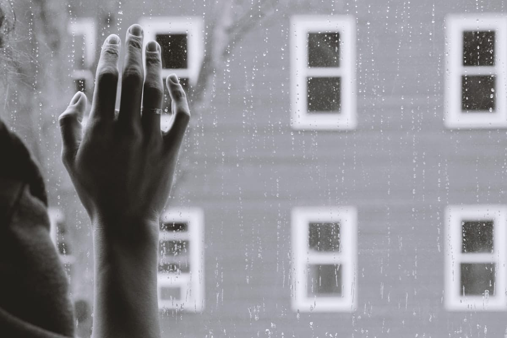

---



Photo
by [Kristina Tripkovic](https://unsplash.com/@tinamosquito?utm_source=ghost&utm_medium=referral&utm_campaign=api-credit) / [Unsplash](https://unsplash.com/?utm_source=ghost&utm_medium=referral&utm_campaign=api-credit)

Às vezes acontece de ler algo e a interpretação que você tira é totalmente diferente de quando você o reler algum tempo
depois. Isso é o esperado, visto que nossa vivência está sempre nos moldando, nossa história são calos que marcam e
moldam nossa alma, constantemente. Redescobri, esses dias, Drummond. Li _Não se mate_ na adolescência e dessa vez foi de
tirar o folego! Antes de escrever, leio mais uma vez, agora ao som de `Goodbye Kiss`, `Kasabian`. Se puder, lhe convido
a fazer o mesmo.


Abaixo, o poema, humildemente narrado por mim 😜

::audio-card{src="https://www.marcal.dev/content/media/2023/11/nao-se-mate-drumm.mp3"}
#caption
Não se mate, de Carlos Drummond de Andrade
::

### Não se mate, de Carlos Drummond de Andrade

```
   Carlos, sossegue, o amor 
   é isso que você está vendo:
   hoje beija, amanhã não beija, 
   depois de amanhã é domingo 
   e segunda-feira ninguém sabe 
   o que será.
   
   Inútil você resistir
   ou mesmo suicidar-se.
   Não se mate, oh não se mate,
   reserve-se todo para 
   as bodas que ninguém sabe 
   quando virão, 
   se é que virão.
   
   O amor, Carlos, você telúrico,
   a noite passou em você, 
   e os recalques se sublimando,
   lá dentro um barulho inefável,
   rezas, 
   vitrolas,
   santos que se persignam, 
   anúncios do melhor sabão, 
   barulho que ninguém sabe
   de quê, 
   pra quê.
   
   Entretanto você caminha
   melancólico e vertical.
   Você é a palmeira, você é o grito 
   que ninguém ouviu no teatro
   e as luzes todas se apagam. 
   O amor no escuro, não, no claro,
   é sempre triste, meu filho, Carlos, 
   mas não diga nada a ninguém, ninguém sabe nem saberá.

```

Imagino, sentado, numa mesa de bar, alguém amargurado, ouvindo esses conselhos. Ora, espere! Ele está só! De fato,
Carlos é a consciência, a razão de Carlos!

```
   Carlos, sossegue, o amor 
   é isso que você está vendo:
   hoje beija, amanhã não beija, 
   depois de amanhã é domingo 
   e segunda-feira ninguém sabe 
   o que será.

```

A vida é assim, `eu te amo, mas hoje nem tanto` e não há nada de errado nisso. Hoje se beija, amanhã não se beija,
depois não se sabe o que virá!

```
   Inútil você resistir
   ou mesmo suicidar-se.
   Não se mate, oh não se mate,
   reserve-se todo para 
   as bodas que ninguém sabe 
   quando virão, 
   se é que virão.

```

Acredito que não amamos apenas uma vez na vida, pelo contrário vamos amar de diferentes formas e intensidades. Do
contrário, quão triste seria se só houvesse uma alma gêmea reservada por pessoa. Seja lá o tenha acontecido, não se
mate, isso passa, como tudo já passou e passará.

```
   O amor, Carlos, você telúrico,
   a noite passou em você, 
   e os recalques se sublimando,
   lá dentro um barulho inefável,
   rezas, 
   vitrolas,
   santos que se persignam, 
   anúncios do melhor sabão, 
   barulho que ninguém sabe
   de quê, 
   pra quê.

```

Que barulho aí dentro em Carlos! Tem um rádio ou uma TV ligada aí, ou, quem sabe seja um turbilhão de emoções e
sentimentos? Lá dentro, em seu coração, em sua alma, há uma grande movimentação (_telúrica_) e você tenta reprimir esses
sentimentos, pô-los em ordem.

```
   Entretanto você caminha
   melancólico e vertical.
   Você é a palmeira, você é o grito 
   que ninguém ouviu no teatro
   e as luzes todas se apagam. 

```

Em contraste de todo conflito e confusão dentro (_de você_), aí fora (_agora, fisicamente_) você tenta seguir, mesmo
triste, você não perde sua postura. As pessoas são assim, duas, três coisas ao mesmo tempo. Simples e complexas,
silenciosas e barulhentas. Lúcidas e incrivelmente ignorantes. A beleza de ser `humano` está na sua complexidade.

Mesmo com um turbilhão de sentimentos, que em algum momento nos parece quebrar por dentro, temos a aptidão natural de
ser a palmeira que não é derrubada pela tempestade!

Um turbilhão de sentimentos, que como o rádio e TV ligado ao mesmo tempo, um em cada lado do seu ouvido, faz o silêncio
ser questão de vida e morte.

O grito (`como no teatro vazio`) é a proclamação de que sim, aqui tem vida, e viver é maravilhoso!

Essa nossa capacidade de ser dúbio, ter sentimentos conflitantes nos permite, mudar, transformar, evoluir, sermos
empáticos, enfim, aprender! Nos permite entender, que primeiro, respeito é qualidade inseparável do amor, mesmo quando
este não existe mais.

```
   O amor no escuro, não, no claro,
   é sempre triste, meu filho, Carlos, 
   mas não diga nada a ninguém, ninguém sabe nem saberá.

```

Termino esse texto, ouvindo `While the song remains the same`, Canção de Noel Gallagher's High Flying Birds, porque é
preciso encontrar-se, conhecer sua essência. Aqueles momentos incríveis juntos, a certeza de ontem, você era tão feliz e
a insegurança de hoje. Talvez não exista mais risos, fotografias. Esses momentos continuam aí, os bons e os ruins, por
mais que não desejamos passar por isso, são os calos em nossa alma.

Do mesmo jeito que essa pessoa, de repente não faz mais sentindo na sua vida (_e lembre-se, provavelmente quando ela
entrou na sua vida, você não imaginava que faria tanto sentindo depois_), tudo isso está a sua mão novamente, quem sabe
na próxima esquina, talvez a `Fortuna` lhe reserve alguma surpresa.

Mas você precisa se permitir a isto.

Coragem é o que é preciso da gente.