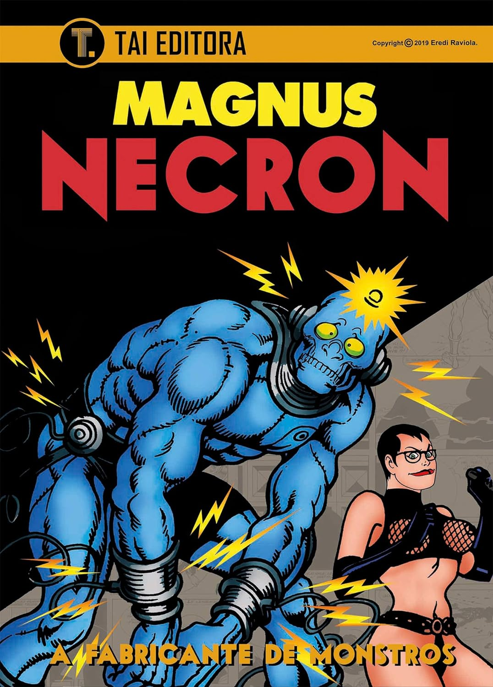

----

>Necron é uma paródia sexy de Frankenstein e apresenta as aventuras da Dra. Frieda Boher, uma ninfomaníaca necrófila, e de sua criatura, Necron, um humanóide forte, bem dotado e canibal, criado com partes de cadáveres para satisfazer os desejos de Frieda.

Essa foi uma leitura rápida; não sei realmente se posso descrever como ficção científica, erótica ou horror, mas eu gostei. Para quem achar que é algo puramente erótico, já vi mais cenas explícitas em [Bórgias](https://pt.wikipedia.org/wiki/I_Borgia) ou [Druuna](https://pt.wikipedia.org/wiki/Druuna) do que nesta primeira edição de Necron.
