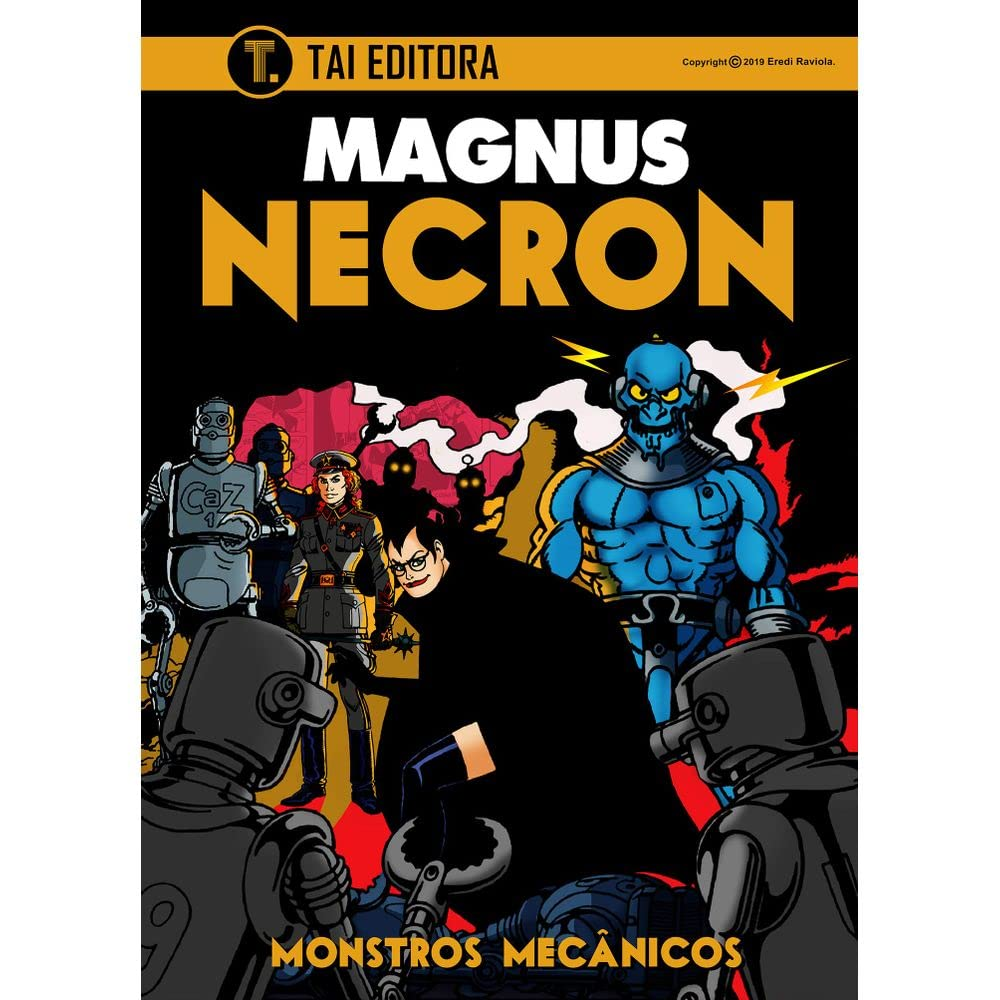

> Após deixar o navio, a doutora Frieda Boher e Necron chegam à uma pequena ilha. Eles então descobrem que essa ilha não é tão isolada quanto pensavam e terão que enfrentar a ameaça dos "Monstros Mecânicos".

Esse eu não gostei muito, achei que foi aleatório demais ter uma base secreta com uma tecnologia tão avançada nessa ilha misteriosa. Talvez essa aleatoriedade seja uma constante nessa série, então, quem sabe, a doutora Frieda não acabe se deparando com um extraterrestre? Veremos, vou continuar acompanhando.