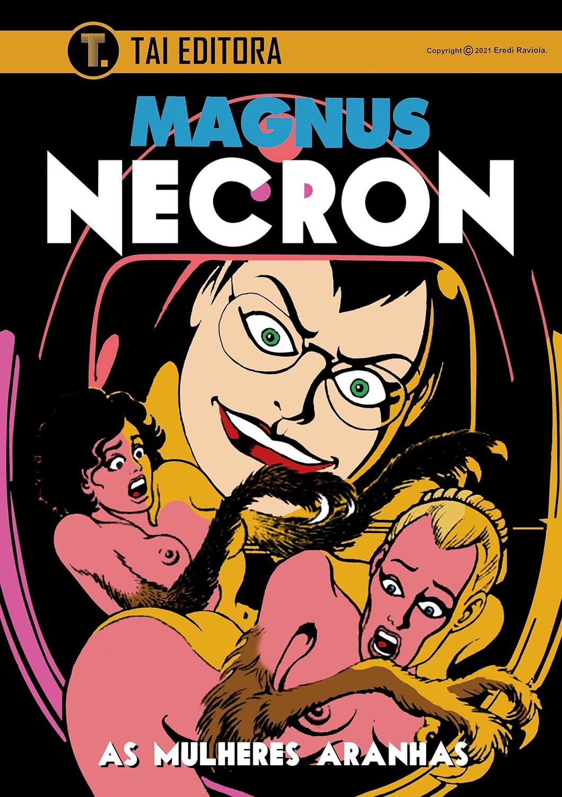

> Necron, criação do artista italiano Roberto Raviola (1939 – 1996) – conhecido pelo pseudônimo Magnus (autor de Kriminal, Satanik, Alan Ford, dentre outros), é um dos quadrinhos mais divertidos e politicamente incorretos deste autor. A obra é uma mistura de terror, erotismo e humor. Após derrotar os “Monstros Mecânicos“, a Dra. Frieda Boher e Necron tomam conta da ilha. Eles não imaginavam que a misteriosa ilha também estava na mira de outros invasores e agora terão que defender o território com um dos métodos mais bizarros já imaginado: As Mulheres Aranhas.

O nome do titulo desse volume é um trocadilho, leia por sua conta e risco. Se você é uma pessoa sensível, fique longe dessa publicação. Talvez, hoje ela nem resistisse ao politicamente e nem fosse publicada. Definitivamente, não é uma obra de arte, é para aqueles que tem gostos duvidosos. Eu adorei.