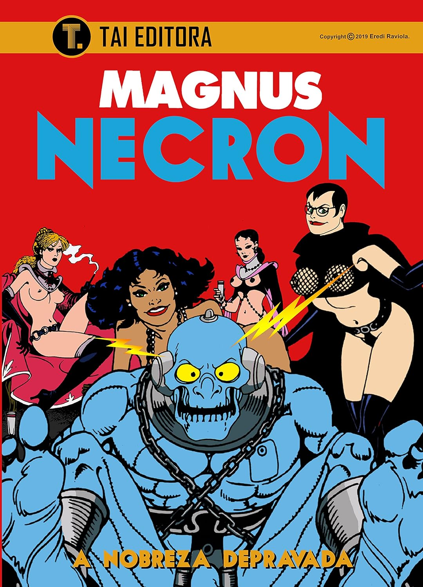

> Após deixarem a ilha, no final de **_"As Mulheres Aranhas"_**, a Dra. Frieda Boher e Necron encontram um estranho culto formado por mulheres da alta sociedade. Entre as facetas dessa sociedade secreta está a tortura sexual de homens e o canibalismo. Tudo isso em: A Nobreza Depravada.

Dessa vez, quis algo leve para ler, algo que não exigisse muito raciocínio, e o escolhido foi _Necron_, a série que eu havia deixado de lado há alguns meses. Na verdade, dizer que é "leve" é suavizar demais a coisa. Como sempre, _Necron_ não é para todo mundo: sexo explícito, sadomasoquismo, tortura... É um quadrinho bastante underground.

Recomendo muito!