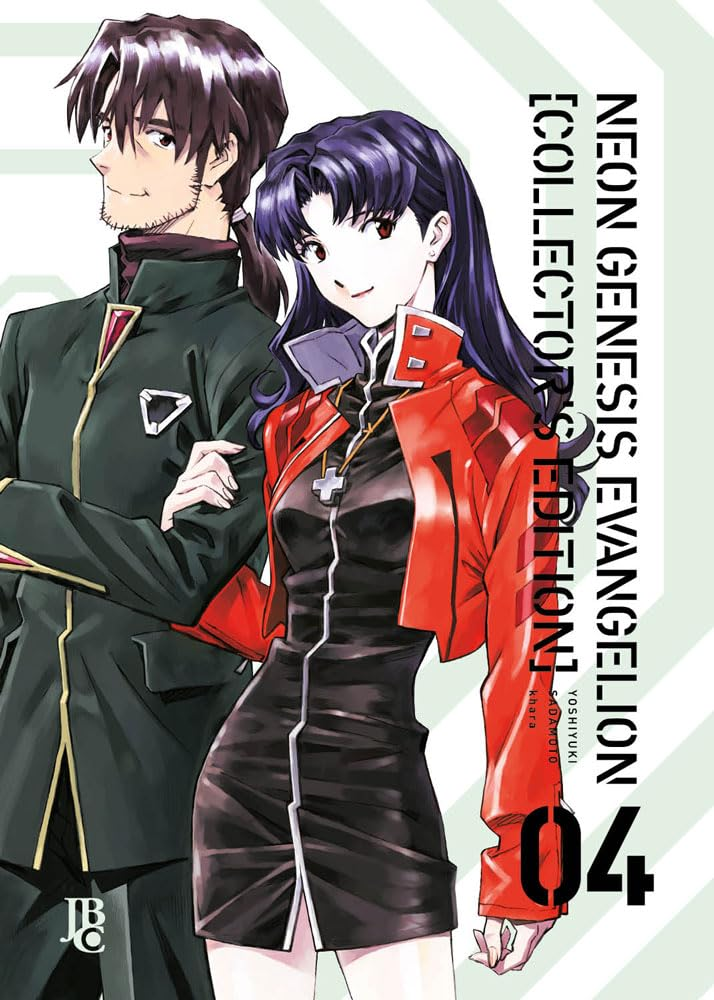

> Depois do acidente que ocorreu durante a batalha contra o último Anjo, Shinji está decidido a nunca mais pilotar um Eva e confronta seu pai. Porém, enquanto Asuka e Rei enfrentam um novo e poderoso inimigo, o garoto fica sabendo mais a fundo sobre o que foi o Segundo Impacto. Já nos bastidores, uma batalha de poder se desenrola ao mesmo tempo que a origem na NERV é revelada.

Não tem muito o que falar de Evangelion: é um clássico absoluto e essa edição está super caprichada. 
Único problema é a demora em sair uma nova edição. Nesse ritmo, o ultimo volume sai lá para 2026.