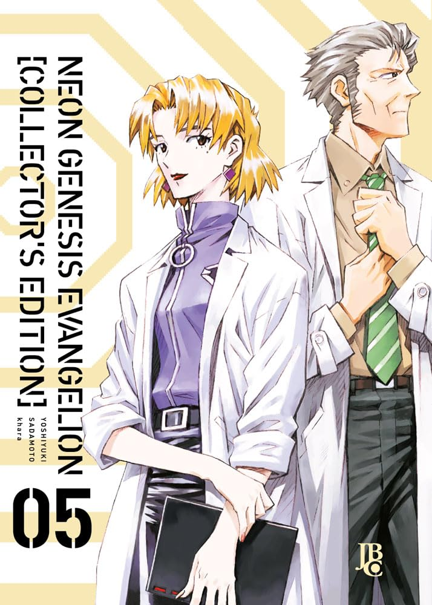

> Shinji ainda sofre com a perda de um amigo próximo e se recusa a voltar para a escola. Com isso, Asuka decide tomar a frente e mostrar à NERV que pode ser tão boa piloto quanto o garoto, porém, acaba sendo afetada pelas habilidades de um anjo, comprometendo sua missão. Além de Shinji, Asuka e Rei, mais uma criança entra no cenário dos pilotos de EVA, porém, o novo garoto parece um tanto diferente do normal... especialmente quando o segredo de Rei finalmente vem à tona.

Faltam apenas dois volumes para eu terminar o mangá, e a história está ficando cada vez mais sombria. Assim como no anime, é fascinante ver como são exploradas todas as questões psicológicas desenvolvidas por Shinji, Asuka e Rei. Notamos algumas diferenças em relação ao anime, em que certas cenas são expandidas, esclarecendo melhor alguns momentos que eram um pouco confusos no anime. Não há muito mais o que dizer: este mangá é uma verdadeira obra de arte e faz jus a toda a sua influência e fama!