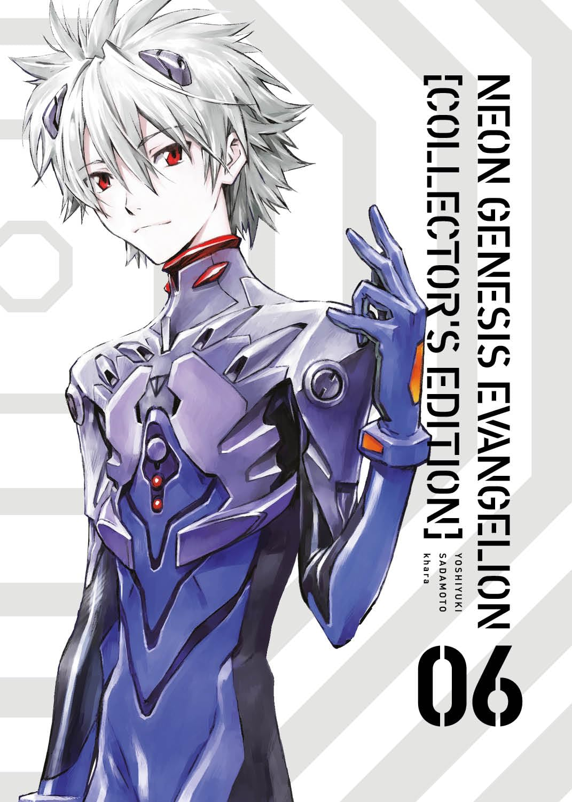

> Preso às dúvidas e à solidão, após perder mais uma vez pessoas que lhe são queridas, Shinji se vê passando por uma profunda crise. Enquanto isso, a Seele decide agir para combater Gendo Ikari. A NERV está sob ataque e verdades perturbadoras estão prestes a vir à tona.

Eu sou suspeito para falar. Adoro a animação e gosto do final, que é bastante polêmico e divide opiniões. Dito isso, estou adorando acompanhar essa história pelo mangá pela primeira vez. Ele esclarece muitos pontos que, na animação, parecem estranhos ou fora de lugar. Até o momento, para mim, o mangá parece superior ao anime, guardadas as devidas proporções, já que são mídias diferentes.

Neste volume, vemos Shinji enfrentando um quadro claro de depressão, se distanciando das pessoas e sentindo que não vale a pena criar conexões, já que "todos irão abandoná-lo de qualquer forma". Ele sente que sua vida não faz sentido e que não possui um lugar claro no mundo — exceto como a ferramenta que pilota o EVA. O volume traz explicações cruciais para a obra, conectando elementos como Adão, os Anjos, os Evas e a Humanidade, além de abordar o papel da Seele e da Nerv no Plano de Instrumentalização.

Tenho noção de que essa não é uma história para todos, não porque seja pesada — não é, embora possa conter gatilhos devido ao estado psicológico dos personagens —, mas porque pode ser considerada confusa (algo que o mangá esclarece bem mais que a animação) ou até mesmo monótona em alguns momentos. Eu, porém, adoro. E sei que, depois de terminar o último volume, vou querer maratonar novamente as animações. Recomendo muito!