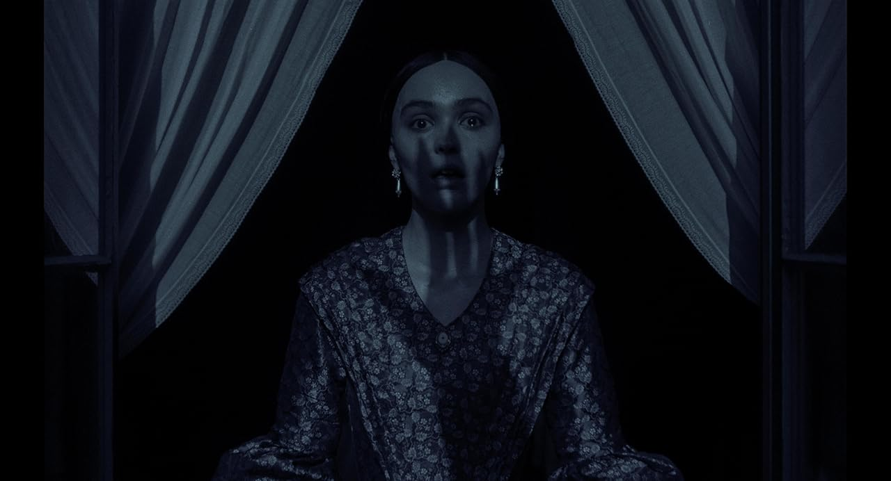
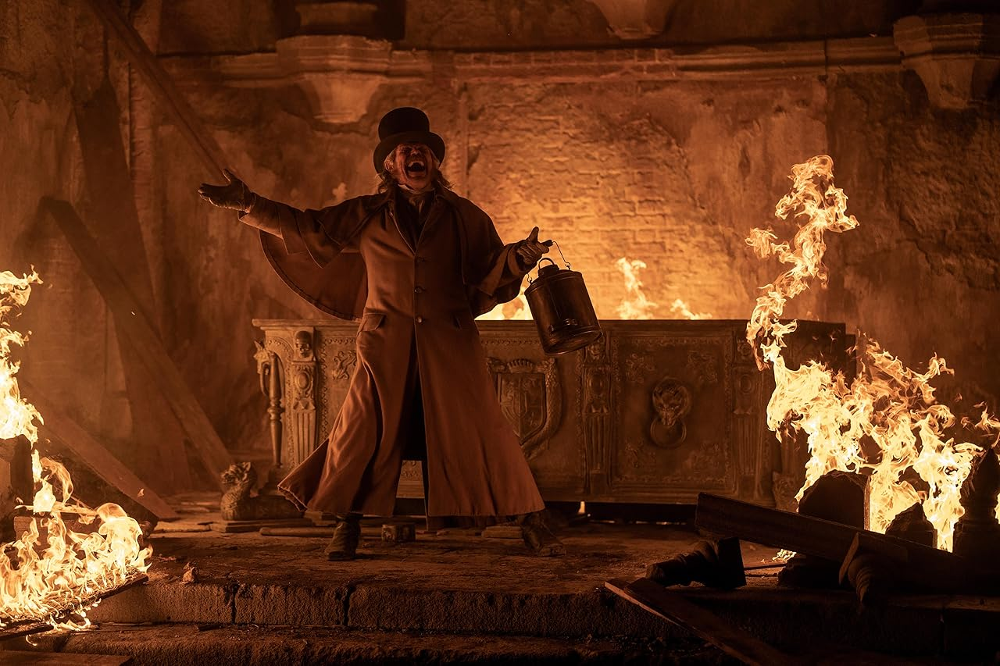

Adoro tudo sobre vampiros, especialmente aqueles que remetem à mitologia raiz. **Nosferatu** não decepcionou nesse aspecto.

Devo admitir que, em alguns momentos, a escuridão me incomodou um pouco, mas entendo completamente que essa é a proposta do filme. Acredito que essa técnica foi usada para criar uma atmosfera de _pura maldade_, onde a luz e a esperança não existem. 

Apesar da constante escuridão, o filme trouxe ótimos momentos de luz que contrastam de forma marcante com a ambientação sombria. 

Willem Dafoe, mais uma vez, entregou uma atuação insana. Ele é simplesmente "o cara", sem dúvidas!

