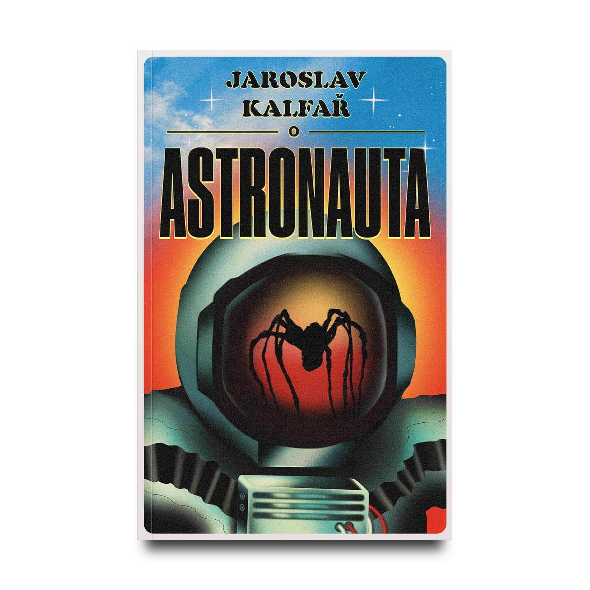

>Quando Jakub Procházka decide abandonar a vida pacata de professor e se tornar astronauta, sua expectativa era embarcar em uma viagem arriscada para coletar uma misteriosa poeira cósmica surgida entre Vênus e a Terra e voltar para casa. São e salvo.
>Quando essa missão espacial não acontece como o planejado, Jakub passa a se sentir insuportavelmente solitário ― até fazer amizade com um estranho alienígena. Deixando o leitor na dúvida entre o que é alucinação e o que é realidade, essa dupla inusitada trava conversas profundas sobre temas diversos, de questões existenciais à maravilha do bacon.  
>Unindo drama, humor e personagens complexos ― além de ter como plano de fundo a história política da República Tcheca ―, esta ficção científica original e contemporânea nos leva não só a uma viagem interplanetária de tirar o fôlego, mas também ao momento único de um homem que busca se reconciliar consigo mesmo, com seu passado e com sua nação.

Antes de ler, assisti ao filme adaptado e estrelado por Adam Sandler, que, por sinal, teve uma atuação dramática muito boa. Para falar a verdade, é uma história mais sobre ficção dramática do que ficção científica.

A solidão de Jakub cria a oportunidade para ele lembrar-se da história e dos eventos de seu país e de sua família. Traumas, acontecimentos não totalmente digeridos e finalizados e como isso afetou sua vida e seus relacionamentos, Jakub revisita tudo isso acompanhado de um curioso novo amigo na solidão de sua nave: um alienígena aracnídeo, que tem seus próprios problemas e desenvolve novos também ao entrar em contato com os traumas de Jakub. Seria imaginário ou não esse amigo alienígena? Honestamente, nem tem tanta importância assim; o que importa mesmo são as reflexões de cunho moral que a história vai desenvolvendo.

Esse é o tipo de história que promete pouco, mas entrega muito, principalmente do meio ao fim. Voltarei a ler novamente no futuro e, é claro, que recomendo!