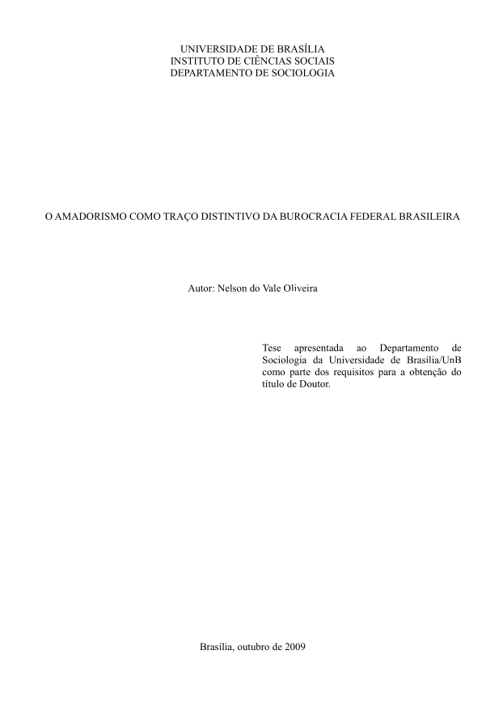

> Um profissional conhece seu trabalho, especializa-se nele, possui os instrumentos necessários e executa as tarefas de forma previsível e cautelosa. A burocracia pública federal, no entanto, está em constante reformulação, repleta de novos projetos, vale-se de procedimentos obscuros e instáveis, é generalista e apressada. Com uma organização resultante de sucessivas e inacabadas reformas, trabalha sem gestão de pessoas ou de materiais. Não há aumento de responsabilidade, complexidade das tarefas ou hierarquia ao longo dos anos de serviço: os chefes são nomeados sem qualquer critério formal, não têm mandato e são removidos sem aviso prévio. Projetos novos são iniciados usando os mesmos recursos dos antigos, que são, simplesmente, esquecidos. Até mesmo repartições inteiras são criadas e extintas ao sabor das circunstâncias. O burocrata, na verdade, nunca sabe o que fará na semana seguinte. Poderá passar os dias carimbando papéis ou reunindo-se com embaixadores, ou mesmo ficar sem qualquer tarefa específica. O resultado é um ambiente de trabalho marcadamente amador, no qual as atividades se dão de forma exploratória e incipiente.

Esta é a tese de doutorado do Nelson, defendida em 2009. Tive o prazer de trabalhar com ele mais ou menos nessa época, no Ministério do Planejamento. Havia me esquecido desse trabalho até pouco tempo atrás, quando trocamos alguns e-mails, e então finalmente decidi colocá-lo em dia. A tese pode ser lida na íntegra, gratuitamente, no [Repositório Institucional da UnB](https://repositorio.unb.br/jspui/handle/10482/18548?locale=pt_BR).

Não tenho muito a acrescentar para "vender" a tese; o resumo do trabalho que copiei acima já faz isso muito melhor do que eu.

A pesquisa é o resultado de estudos de caso, pesquisa documental (relatórios de auditoria, atividades, etc.), observação direta e relatos de servidores, que foram protegidos pelo anonimato.

Entre tantos pontos destacados, a burocracia do serviço público é marcada pela **instabilidade** e pela **informalidade**, evidenciada pela ausência de formalização nas rotinas e nas reuniões (sem atas ou pautas). Outro fator notável é a **gestão precária**: chefias são nomeadas sem critérios claros, sem mandato e podem ser removidas arbitrariamente. Algo curioso é que as tarefas são distribuídas sem organização clara, dependendo mais da disposição ou do perfil individual do funcionário. Como diz o ditado: "toda produtividade será punida" — um servidor "pau para toda obra", conhecido por aceitar qualquer tarefa, acaba sendo sobrecarregado, enquanto outro que "faz corpo mole" ou demora a entregar o trabalho será cada vez menos demandado. No fim, esse último pode acabar com uma jornada mais tranquila, algo que talvez fosse sua intenção desde o início.

Já faz quase cinco anos que deixei de trabalhar na burocracia brasileira (minha última experiência foi na Câmara dos Deputados). Não sei se as coisas continuam iguais — aposto que sim —, mas tenho certeza de que, assim como eu, quem já trabalhou na burocracia reconhecerá várias situações descritas na tese, que facilmente poderiam fazer parte do seu dia a dia.

> O chamado "ciclo das políticas públicas" seria formado por algo como "formação
da agenda, formulação, monitoramento e avaliação". Esta imagem, um tanto idealizada e
outro tanto ingênua, é bastante difundida no Serviço Público. Fosse ela uma representação
de como as coisas de fato se dão, poderíamos reescrevê-la, inspirados em ditos dos
próprios servidores, mais ou menos como segue: "caiu de pára-quedas" (nasceu um
projeto), "driblar a burocracia" (estratégia para implementação), o "sapo cururu"
(retrabalho), "deu em água" (morreu um projeto) e "cada enxadada, uma minhoca"
(justificativas para auditores).