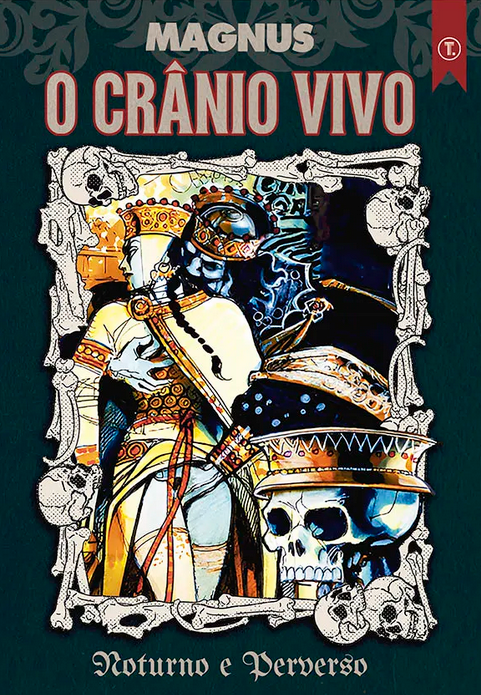

>Na floresta, o rei dos Gépidas, Cunimundo, salva a jovem Ersília das garras de um urso, mas faz dela sua amante. A avó de Ersília, uma verdadeira bruxa, mestra das artes mágicas, querendo vingança, influencia o rei Alboíno, inimigo de Cunimundo, para atacá-lo. Alboíno, por sua vez, quer para si Rosamunda, filha do rei inimigo, por isso pretende conquistar o reino dos Gépidas.
  Ao vencer a batalha, Alboíno toma posse de Rosamunda, finge libertar Cunimundo, mas manda matá-lo. Depois disso, transforma seu crânio em um copo no qual obriga Rosamunda a beber.
  O crânio do pai ganha vida graças ao trabalho de um necromante, e aconselha Rosamunda sobre como efetuar sua vingança.

Esse é o primeiro livro da **Coleção Noturno e Perverso**, da Tai Editora. Mais um trabalho desenhado por Magnus. Estou gostando bastante de conhecer o trabalho desse desenhista. Algo que sempre noto é que seus quadros são amplos e grandes, o que resulta, nesse formato, em cerca de dois quadros por página. Não me lembro de ter visto mais quadros do que isso. Interessante essa escolha artística.

Aparentemente, a trama envolvendo Rosamunda, filha do rei gépida Cunimundo, e Alboíno, rei dos lombardos, realmente aconteceu. Imagine Alboíno obrigando Rosamunda, sua esposa, a beber de uma taça feita do crânio de seu pai, e todas as consequências e conspirações que surgiram a partir disso, resultando no assassinato de Alboíno. Parece até uma trama de ficção, não é mesmo? Inclusive, essa história inspirou o filme italiano _Rosmunda e Alboino_ (ou _A Espada do Conquistador_), de 1961. Ainda não assisti, mas vou conferir.

Além disso, a obra é erótica, com vários quadros explícitos. É uma obra de Magnus, afinal, então pode não agradar a todos. Eu gostei.

