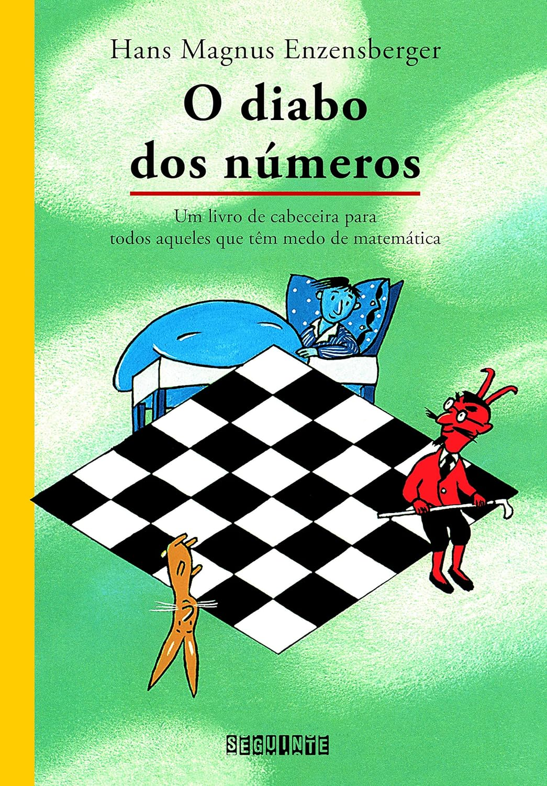

>Sabe de uma coisa ? A maioria dos matemáticos de verdade nem sabe fazer contas . E, além do mais , eles nem têm tempo para isso . Para fazer contas existem as calculadoras.

> Matemática? Aquela montanha de números sem sentido? Aqueles cálculos que não servem para calcular nada? Não, nem pensar. O autor deste livro sobre matemática é um dos maiores poetas contemporâneos de língua alemã - e esse dado já seria suficiente para indicar até que ponto O diabo dos números é original. O livro nega desde o início aquele lugar-comum segundo o qual quem gosta de matemática não gosta de literatura ou, numa outra versão, quem sabe fazer conta não sabe escrever.Robert, o menino do pijama azul, fazia parte dessa maioria que acha os números não só monstruosos, mas também absurdos e inúteis. Um dia, entretanto, ele começa a sonhar com um certo Teplotaxl, um diabo que pinta e borda com a matemática. No total, são doze sonhos, e a cada sonho o tal Teplotaxl faz malabarismos tão interessantes que os números simplesmente deixam de ser malditos. Ficam claros para Robert. Claros e diabolicamente divertidos.Prêmio Monteiro Lobato "A Melhor Tradução/Informativo" pela Fundação Nacional do Livro Infantil e Juvenil - FNLIJ 1997

Tive que ler a versão em inglês, pois a versão em PDF em português que circula na internet apresenta um erro estranho nas imagens com números, o que tornou a leitura bastante inviável.

É uma leitura leve, uma história _nonsense_ (sem o sentido pejorativo), como _Alice no País das Maravilhas_ ou _Emília no País da Gramática_. É um ótimo texto de divulgação para se apaixonar pela matemática ou despertar interesse nela. Ideal para apresentar a uma criança. Eu gostei.