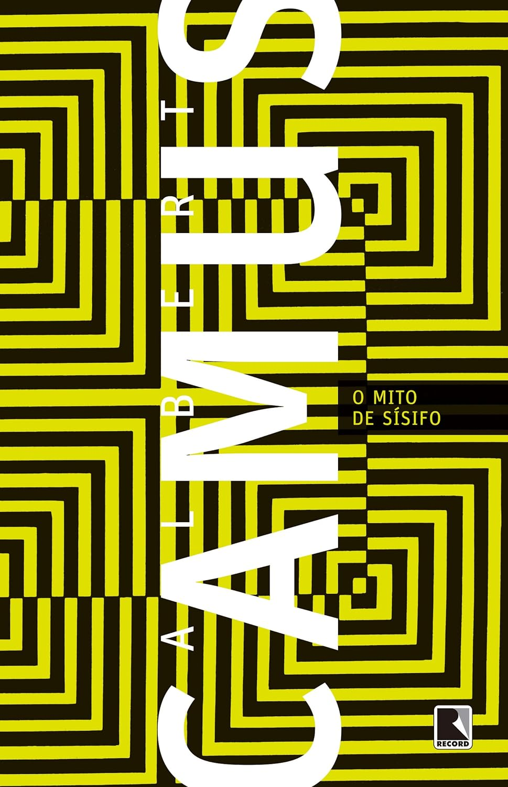

----

> Albert Camus, um dos escritores e intelectuais mais influentes do século XX, publicou O mito de Sísifo em 1942. Este ensaio sobre o absurdo tornou-se uma importante contribuição filosófico-existencial e exerceu profunda influência sobre toda uma geração. Camus destaca o mundo imerso em irracionalidades e lembra Sísifo, condenado pelos deuses a empurrar incessantemente uma pedra até o alto da montanha, de onde ela tornava a cair, caracterizando seu trabalho como inútil e sem esperança.

É uma leitura curta mas certamente não fácil. 

> Começar a pensar é começar a ser atormentado.

Camus demonstra todo o seu repertório intelectual ao citar diversos autores. Acompanhar suas ideias durante a leitura foi bastante desafiador para mim, pois me falta esse conhecimento prévio. Portanto, é um livro que demanda múltiplas leituras para assimilar corretamente o que está escrito. 

O livro trata sobre o "único problema filosófico realmente sério: o suicídio."

> Só existe um problema filosófico realmente serio: o suicídio. Julgar se a vida vale ou não vale a pena ser vivida é responder à pergunta fundamental da filosofia.

Na minha humilde ignorância, como alguém que não conseguiu acompanhar todo o raciocínio, gostei especialmente do final.

> Deixo Sísifo na base da montanha! As pessoas sempre reencontram seu fardo. Mas Sísifo ensina a fidelidade superior que nega os deuses e ergue as rochas. Também ele acha que está tudo bem. Esse universo, doravante sem dono, não lhe parece estéril nem fútil, cada grão dessa pedra, cada fragmento mineral dessa montanha cheia de noite forma por si um mundo. A própria luta para chegar ao cume basta para encher o coração de um homem. É preciso imaginar Sísifo feliz.

Esta obra é uma jornada para superar o niilismo e encontrar significado no absurdo da existência. Com certeza, voltarei a ela novamente!
