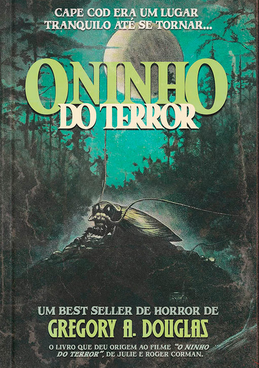

O que parecia ser apenas um depósito de lixo comum na pacífica ilha de Yarkie revelou-se o ambiente perfeito para a proliferação de uma ameaça inesperada. O calor, a umidade e a abundância de alimento transformaram o local em um verdadeiro berçário. Quando uma alteração no controle de venenos desencadeia uma mutação imprevisível, nascem criaturas aterrorizantes: baratas gigantes e famintas. Agora, elas estão prontas para deixar seu ninho – e a caça por carne humana começou!

> Não havia maneira de aceitar tamanha atrocidade. O excremento da natureza havia se transmutado em algo diabólico. Mais do que bárbaro, mais do que cruel – *maligno*. Era algo que ultrapassava qualquer ferimento, maldição ou condenação. Era a personificação do Inferno, ao vivo e a cores.

Comecei esse livro sem grandes expectativas. Na verdade, comprei mais para apoiar a [Tai Editora](https://www.lojadatai.com.br/), uma pequena editora independente muito interessante, que trouxe _Magnus_ e _Suspiria_ – títulos que já apareceram aqui no blog. Mas que surpresa! A história é ótima e me lembrou muito aqueles filmes trash dos anos 80 e 90, como _Anaconda_, _Ataque dos Vermes Malditos_, _Pânico no Lago_ e _O Hospedeiro_.

> (...) se a principal regra da natureza era de fato a sobrevivência do mais forte, os homens tinham o direito natural de impor sua inteligência contra aquelas baratas.

Logo após o lançamento, o livro foi adaptado para o filme _O Ninho do Terror_, que nunca conferi, mas que foi elogiado pelo próprio autor da obra. Pelo que li, o filme trouxe algumas diferenças na história.

Falando em filme, a narrativa do livro realmente parece cinematográfica, inclusive no desfecho. Sabe aquelas histórias em que o inimigo é derrotado, há um momento de calmaria e comemoração, e então, de forma surpreendente, ele reaparece nos últimos instantes – seja para ser derrotado de vez ou para deixar um gancho em aberto? Pois é. Do início ao fim, a forma como o autor conduz a história é extremamente visual e envolvente. Consegui imaginar cada cena e sentir a tensão dos personagens ao se depararem com as mortíferas baratas.

> Ter filhos? Como?  Se o pau e as bolas tinham sido comidos naquela ilha maluca?

A explicação sobre o funcionamento da organização das baratas, semelhante à de cupins, formigas e abelhas – insetos que trabalham juntos de forma altamente social – foi muito interessante. No entanto, a grande revelação sobre essa estrutura organizacional não me impactou tanto. Para falar mais sobre isso, eu teria que dar um spoiler gigantesco.

No geral, é uma ótima história, com aquele toque nostálgico dos clássicos sobre animais peçonhentos e ameaçadores. Recomendo muito!