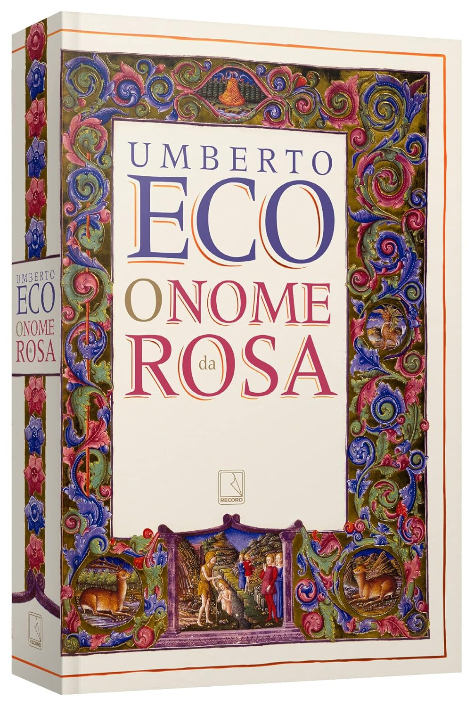

## Conteúdo

## O nome da Rosa

> Neste mosteiro, paira a suspeita de heresia, e para a investigação é enviado o frei Guilherme de Baskerville. Porém, a delicada missão é interrompida por sete excêntricos assassinatos. A morte, em circunstâncias insólitas, de sete monges em sete dias e sete noites conduz uma narrativa violenta, que encanta pelo humor e pela crueldade, pela malícia e pela sedição erótica.

Ao começar _O Nome da Rosa_, deparei-me com um romance que combina mistério, história e filosofia em uma narrativa rica e instigante. Antes de tudo, trata-se de um romance policial, à moda de Agatha Christie ou Arthur Conan Doyle, com seu Sherlock Holmes. A dupla de protagonistas, Guilherme de Baskerville e o jovem Adso de Melk, parece até uma homenagem a esses clássicos: Guilherme, com sua sagacidade impressionante, remete a Sherlock, enquanto Adso, cujo nome soa similar a "Watson", assume o papel de narrador aprendiz.

Entretanto, o livro vai muito além de um simples mistério. É também um romance histórico, ambientado na Idade Média, que oferece um retrato fascinante desse período. O ritmo da leitura é, sem dúvida, lento em alguns momentos. Eco não se apressa em revelar os mistérios ou em simplificar as discussões históricas para leitores menos familiarizados com o contexto. Isso pode ser desafiador, mas também é o que torna a obra tão enriquecedora. A sensação de aprender enquanto se lê, mesmo que aos poucos, e de desbravar os segredos do mosteiro ao lado de Guilherme e Adso foi o que me manteve engajado até o final.

Umberto Eco explora, com maestria, o contexto político e religioso da época, criando diversas tangentes que ampliam a profundidade da narrativa. Por exemplo, ele descreve em detalhes as diferenças entre ordens monásticas, como os Beneditinos e os Franciscanos, além de abordar os conflitos internos dessas ordens. Um exemplo marcante é o da **Ordem dos Frades Menores Espirituais**, ou **Fraticelli**, um grupo que defendia uma interpretação rigorosa da pobreza evangélica pregada por São Francisco de Assis.

A narrativa conduz o leitor a reflexões provocantes sobre a pobreza evangélica: se Jesus não possuía bens materiais, por que os líderes da Igreja deveriam acumular riquezas? Essa ideia desafiava diretamente o poder e a opulência de muitos clérigos, o que levou à perseguição de grupos como os Fraticelli, tidos como hereges. O livro também apresenta debates filosóficos memoráveis, como a curiosa questão de saber se Jesus ria ou se o riso poderia ser considerado herético. Essa discussão, aparentemente abstrata, conecta-se de forma surpreendente à trama principal e aos misteriosos assassinatos no mosteiro.

Além do mistério, a obra aborda temas que permanecem relevantes até hoje: o conflito entre fé e razão, o poder do conhecimento e o controle exercido pela religião. Esses tópicos são explorados com tanta sutileza e inteligência que me deixaram refletindo muito tempo após a última página.

Contudo, é uma leitura que exige atenção e paciência. Há muitas passagens em latim – algumas sem tradução – que, embora aumentem a imersão na ambientação, tornam o ritmo mais pausado. O estilo de Eco é denso, e sua narrativa está repleta de camadas que recompensam tanto leitores menos experientes quanto aqueles familiarizados com o período histórico. Mesmo para alguém com pouca bagagem sobre a Idade Média, como eu, a experiência foi profundamente imersiva.

Ao final, _O Nome da Rosa_ não é apenas um romance policial ou histórico: é uma obra que nos desafia a refletir sobre poder, conhecimento, fé e a busca pela verdade. É uma leitura exigente, mas profundamente recompensadora, que merece ser revisitada com o tempo. Sem dúvida, este é um livro que guardarei com carinho e um dos melhores que li este ano.

---

## Ei, olha isso!
Achei bem legal colocar uma sessão de links legais e isso deve aparecer de vez quando - quando eu tiver links interessantes de alguma forma. Se quiser pode conferir os [links da última edição](descobri-retrowave#ei-olha-isso).

1. **[Forums Are Still Alive, Active, And A Treasure Trove Of Information](https://aftermath.site/best-active-forums-internet-today)** uma rica coletânea de foruns que ainda estão disponiveis por aí.
2. **[Writing Examples](https://writingexamples.com/)** é uma plataforma gratuita dedicada a celebrar e analisar grandes obras da literatura. O objetivo é fornecer exemplos práticos que ajudem escritores e entusiastas a aprimorar suas habilidades, inspirando-se nos mestres da literatura.
3. **[Personal Website Ideas](https://jamesg.blog/2024/02/19/personal-website-ideas/)** de James G. tem algumas ideias legais para o que se fazer em um site pessoal.
4. **[Ideas for Your Personal Website](https://32bit.cafe/websiteideas/)** Mesma ideia do link anterior: você acabou de fazer um site, e agora o que fazer?
