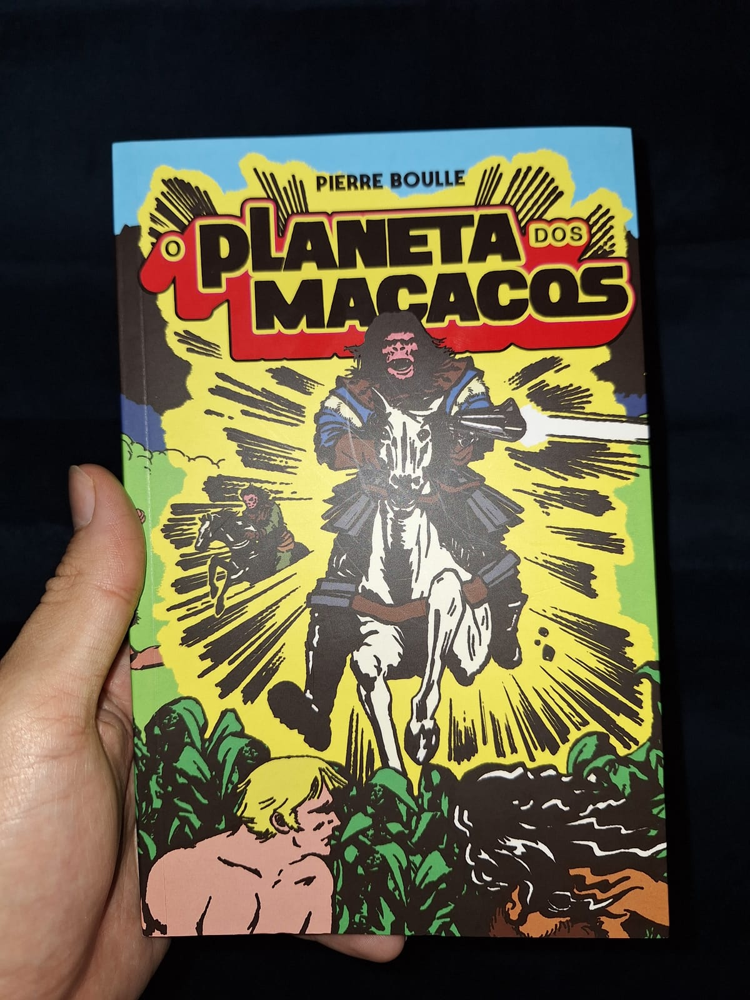

---

Esse eu já havia lido em minha adolescência e mesmo agora, depois de adulto, posso dizer: um clássico da ficção científica!

> Uma tripulação de cientistas desbrava o espaço e descobre uma terrível verdade: no mundo em que pousaram, os seres humanos não passam de bestas selvagens a serviço da espécie dominante: os macacos. Desde as primeiras páginas até o desfecho surpreendente – ainda mais impactante do que a famosa cena que encerra o filme de 1968 –, O planeta dos macacos é um romance de tirar o fôlego, com boa dose de inquietação e sarcasmo.  
> Publicado pela primeira vez em 1963, o livro inspirou uma das franquias mais bem-sucedidas da história do cinema. Com milhões de exemplares vendidos ao redor do mundo, O planeta dos macacos é um dos maiores clássicos da ficção científica, imprescindível aos fãs de cultura pop.

Essa é o tipo de história que me faz lembrar dos tempos em que eu tinha mais tempo, na minha juventude, e devorava histórias de Isaac Asimov, Carl Sagan, Júlio Verne... Isso me trouxe uma nostalgia agradável, e acho que deveria ler mais desses clássicos da Ficção Científica com mais frequência.

Em certo momento, explorei toda a franquia de 'O Planeta dos Macacos': filmes, séries, quadrinhos (embora nem todos sejam tão bons). Acaba que o filme e a história do livro divergem em vários pontos, principalmente no final, mas de toda forma, ambos são ótimos em suas mídias. Este ano, em 2024, deve ser lançado o filme "Planeta dos Macacos: O Reinado" e com certeza acompanharei.

Na minha opinião, o final que funciona melhor é o do filme original, onde os acontecimentos se desenrolam em uma Terra futurística. No livro, os eventos ocorrem realmente em outro planeta, o que torna a trama bastante implausível. Afinal, como seria possível que a fauna desse planeta se desenvolvesse de maneira tão semelhante à fauna da Terra?

O autor, acredito que acertadamente, não se preocupou muito com os detalhes técnicos da história, às vezes deixando de explicar como uma viagem espacial tão distante pelo espaço foi realizada em tão pouco tempo. Além disso, ele não aborda como espécies tão semelhantes puderam evoluir em um planeta diferente.

Considero muitas vezes, até acertado, pois essa falta de informações contribui para a leitura simples e fluída do texto. Fica a cargo do leitor acreditar ou imaginar os possíveis motivos. Eu mesmo fiquei imaginando que a tal viagem estelar não tinha sido realizada, mas apenas uma viagem no tempo, e que os protagonistas não tinham saído do sistema solar o tempo todo. Essa hipótese acabou se provando errada, uma vez que no final o protagonista conseguiu voltar à Terra, e é descrito o Sol, a Terra, os formatos dos continentes, assim como nós conhecemos. Ou será que de alguma forma ele voltou ao passado? Mais uma vez, cabe aqui a interpretação do leitor.

Essa é uma bela edição com uma capa e contracapa com arte que faz parecer uma história em quadrinhos. Ela veio acompanhada com um ímã, desnecessário, mas legal também.

Devorei em duas noites. Também pudera, bastante divertido, com uma linguagem clara e simples. É uma viagem incrível de imaginação. Mesmo já sabendo o final, pude ser pego de surpresa em seus diversos ganchos.