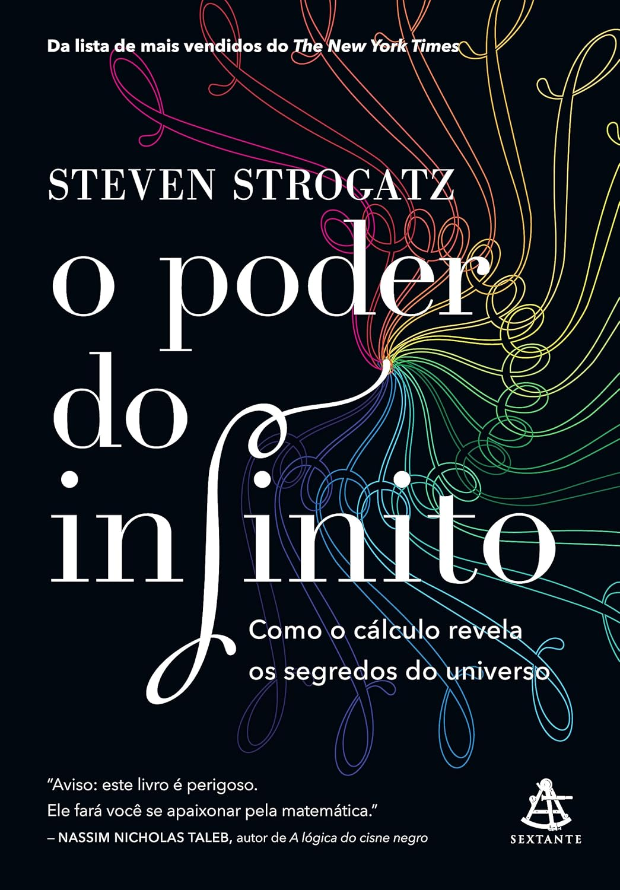

> Este livro é um convite a esquecer o temor que a simples expressão “cálculo diferencial e integral” desperta em muitos de nós, até hoje, e embarcar numa viagem eletrizante sobre a construção dessa linguagem matemática.

O livro desenvolve a história do cálculo desde os pensadores da antiguidade até a era moderna e contemporânea. Faz um excelente trabalho ao explicar, de forma muito didática, o que é o cálculo, suas aplicações e toda a beleza envolvida.

Estou estudando a disciplina por hobby e realmente é um pouco complicado entender todo o conceito e os cálculos, sem falar em compreender sua aplicabilidade. Ao ler este livro, senti que minha mente se expandiu e comecei a entender realmente do que se trata a disciplina, além das fórmulas e cálculos. Por isso, é um bom livro introdutório, um excelente livro de divulgação científica. Motivador até.

Merece uma segunda leitura quando eu já tiver avançado no conteúdo. Nota mil!