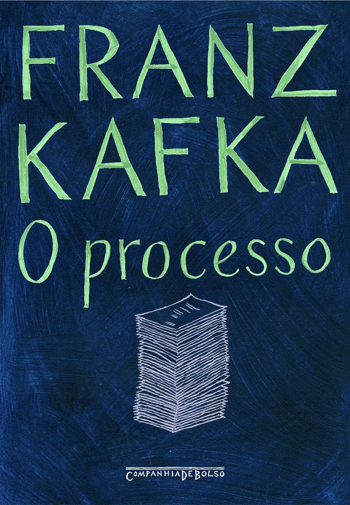

> Na sua luta para descobrir por que o acusam, por quem é acusado e que lei ampara a acusação, K. defronta permanentemente com a impossibilidade de escolher um caminho que lhe pareça sensato ou lógico, pois o processo de que é vítima segue leis próprias: as leis do arbítrio.

Esse é um livro cuja leitura estou enrolando desde março de 2024 e, para ser honesto, não vou finalizar.

Não me entenda mal, a história é boa. Um cara que se vê envolvido em um processo, acusado de algo que ele não sabe o que é, sem direito à ampla defesa. É bastante interessante acompanhar uma história tão absurda assim. Tão absurda, mas tão similar com a atual situação do judiciário politizado brasileiro, onde temos o tal do inquérito das Fake News...

O problema é que a história está inacabada, não tem fim, frases e pensamentos incompletos. É um rascunho não finalizado. A edição que peguei ainda tinha os rascunhos rasurados que Kafka foi excluindo do texto. E isso me desanimou muito. É uma história com potencial, mas ainda não passa de um rascunho.

Então é isso, tem muita coisa ainda a ser lida por aí, e essa leitura não me pegou. Faz parte e bola pra frente.