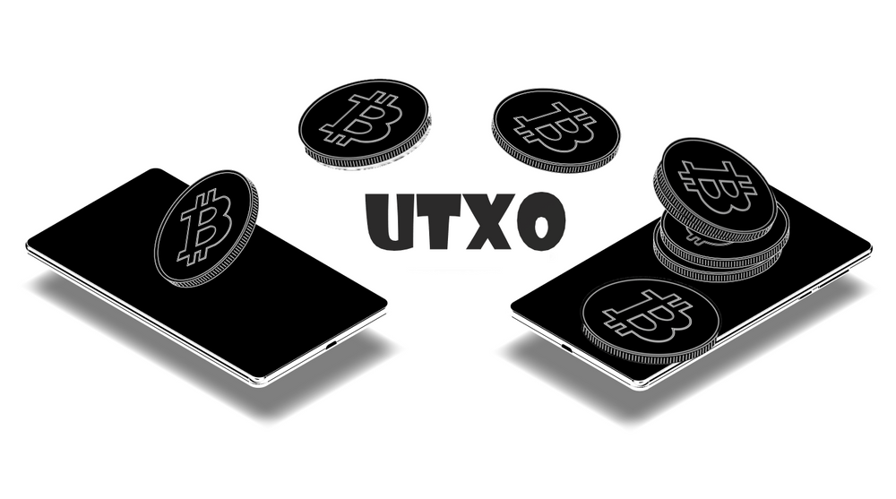

---

UTXO, que significa Unspent Transaction Output (Saída de Transação Não Gasta) em inglês, é uma unidade de moeda não gasta no Bitcoin. Essa unidade está associada a transações anteriores e é utilizada para autorizar e rastrear transações na rede, representando o saldo disponível em um endereço.

Antes de aprofundar, estas são anotações que fiz à medida que aprendi e pesquisei mais sobre o assunto. As informações aqui refletem o estado do meu entendimento, que pode estar desatualizado ou incorreto, apesar das boas intenções. Você pode obter informações "do zero" sobre o Bitcoin a partir do [Guia Bitcoin](https://www.marcal.dev/guia-bitcoin/), o qual foi criado com base nas minhas anotações também. Não confie cegamente; verifique! ⚠️

Quando um bitcoin é enviado de um endereço para outro, não ocorre uma transferência direta de "saldo". Em vez disso, é realizado um gasto de uma ou mais saídas de transações anteriores. O remetente especifica o endereço do destinatário e a quantidade a ser enviada, resultando em uma transação que inclui entradas (inputs) e saídas (outputs).

As entradas referem-se a UTXOs anteriores, ou seja, saídas de transações anteriores que ainda não foram gastas. Elas são cruciais para verificar a origem dos bitcoins utilizados em uma nova operação, mostrando o endereço inicial de recebimento.

Os outputs indicam o endereço de destino da transferência e a quantia enviada, incluindo também o endereço de troco ou devolução para onde vão os valores restantes da operação. Isso possibilita que uma transação tenha múltiplas saídas.

Para ilustrar, considere um endereço que recebeu moedas em três transações diferentes: 0.4 BTC na primeira, 0.3 BTC na segunda e 0.2 BTC na terceira, totalizando 0.9 BTC. Se eu enviar todos os 0.9 BTC dessa carteira para você, as três transações serão combinadas em um único output. Caso eu envie 0.8 BTC para você, restará um troco de 0.1 BTC, enviado de volta ao endereço de troco indicado na transação, resultando em dois outputs.

Outro exemplo é quando você possui um UTXO de 10 BTC e envia 7 BTC para outra pessoa. Nesse caso, o UTXO de 10 BTC é gasto, criando dois novos UTXOs: um para o destinatário com 7 BTC e outro para você mesmo, com 3 BTC de troco.

Normalmente, o remetente inclui uma taxa de transação (fee) para motivar os mineradores a incluir a transação em um bloco. Essa taxa é a diferença entre os inputs e outputs da transação.

Após a criação da transação e a definição das taxas, ela é assinada pelo remetente com sua chave privada, comprovando a propriedade dos UTXOs gastos e autorizando a transferência. Posteriormente, a transação é transmitida à rede Bitcoin e entra na mempool, aguardando inclusão em um bloco.

Os mineradores são encarregados de escolher as transações não confirmadas da pool, verificar a validade da transação, assegurando-se de que não haja tentativas de gasto duplo do UTXO, e tentar incluí-las em um novo bloco por meio do processo de mineração. Após ser incluída em um bloco e adicionada à blockchain, a transação é considerada "confirmada".

Cada transação confirmada possui um identificador hash (Txid) criado com base nas entradas e saídas, distinguindo cada operação de maneira única na blockchain. Quanto mais blocos são adicionados acima do bloco que contém a transação, maior é a segurança de sua confirmação.

Esse processo dificulta o gasto duplo da moeda, pois cada UTXO carrega consigo uma informação única de propriedade, referente ao endereço autorizado a gastá-lo. Sempre que uma transação é proposta, os nodes da rede verificam se os UTXOs estão sendo usados e se pertencem ao remetente.

O UTXO pode levar a acumulações de "poeira" ou "dust", que são pequenas quantidades de moedas que não podem ser gastas por serem menores que o valor mínimo da transação. Entretanto, com o tempo, essa "poeira" pode acumular e tornar-se gastável novamente.

Assim como é possível dividir um UTXO em instâncias separadas, também é possível combiná-las em transações maiores, reduzindo a quantidade delas na rede. Imagine trocar duas notas de 50 reais por uma unica de 100.

A consolidação de saídas de transações não gastas envolve a combinação de vários UTXOs em uma única saída, pode levar a transações futuras mais simples e muitas vezes mais baratas. Quanto mais UTXOs você possui, mais insumos são necessários, resultando em maiores taxas de transação. Ao consolidar seus UTXOs, é possível reduzir o número de entradas e economizar em taxas, tornando a consolidação UTXO uma excelente maneira de economizar em taxas de transação.

* * *

**Referências**

[https://finbold.com/guide/what-is-utxo/](https://finbold.com/guide/what-is-utxo/)  
[https://www.geeksforgeeks.org/what-is-unspent-transaction-output-utxo/](https://www.geeksforgeeks.org/what-is-unspent-transaction-output-utxo/)  
[https://www.blog.areabitcoin.com.br/o-que-e-utxo/](https://www.blog.areabitcoin.com.br/o-que-e-utxo/)  
[https://www.investopedia.com/terms/u/utxo.asp](https://www.investopedia.com/terms/u/utxo.asp)  
[https://br.beincrypto.com/aprender/o-que-e-utxo/](https://br.beincrypto.com/aprender/o-que-e-utxo/)  
[https://etopsaber.com/decifrando-o-papel-dos-utxos-nos-padroes-de-consolidacao-do-bitcoin/](https://etopsaber.com/decifrando-o-papel-dos-utxos-nos-padroes-de-consolidacao-do-bitcoin/)