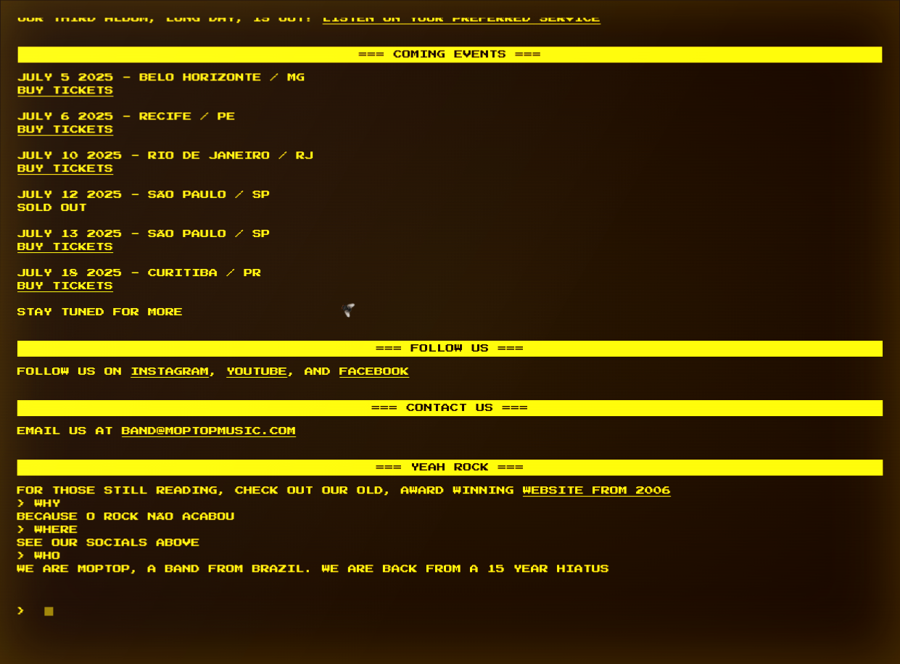
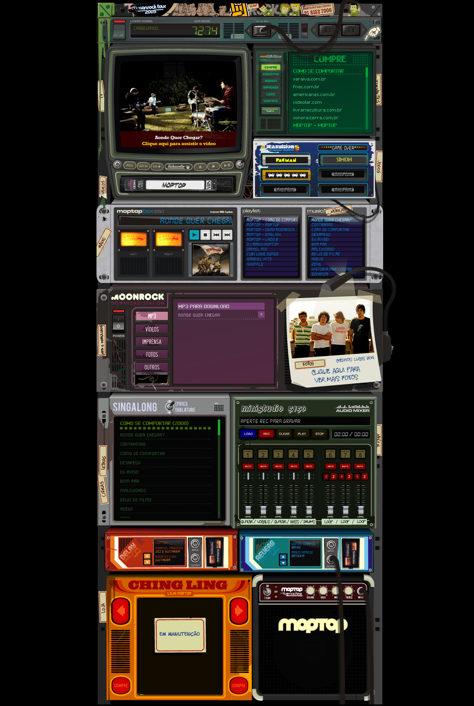

Estava organizando minha biblioteca de músicas digitais quando voltei a ouvir **Moptop** que, pra quem não sabe, foi uma banda bastante relevante entre 2004 e 2010, mais ou menos.

Um som que lembra bastante **The Strokes**, **The Killers**... Entre minhas preferidas: "O Rock Acabou", "Aonde Quer Chegar?" e "Sempre Igual".

```
O rock acabou, melhor ligar sua TV  
Ela nunca está, ela nunca vai entender  
Eu gosto da sua saia assim, vem deitar perto de mim  
Verdade, eu não me importo, quero um amor que não sei mais sentir

— "O Rock Acabou", Moptop
```

Em 2010, a banda anunciou seu fim, com apenas dois álbuns que, aliás, nunca deixei de ouvir. Mas, mais de uma década depois, eis que por acaso descubro que ela **ressuscitou das cinzas**!
Caramba, que surpresa! Por essa eu não esperava. Redes sociais ativas, clipezinho no YouTube e um site simples, retrô, que lembra um terminal:

👉 https://www.moptopmusic.com/main.html 


Uma mosca com seu zum-zum-zum de vez em quando aparece na tela. Se você coloca o mouse sobre ela, ela foge... A tela, como um monitor de tubo antigo, de vez em quando dá umas piscadas. O conteúdo? Um terminal:



Aceita até alguns comandos que explicam, brevemente, algumas coisas importantes. Reproduzo aqui:
- **WHO**: WE ARE MOPTOP, A BAND FROM BRAZIL. WE ARE BACK FROM A 15 YEAR HIATUS
- **WHY**: BECAUSE O ROCK NÃO ACABOU
- **OLD SITE**: E aqui leva ao antigo site da banda, que é uma **obra de arte**! Você tem que conferir:
👉  https://www.moptopmusic.com/old.html



É, meus amigos... Vocês não sabem o quão animado eu fiquei ao saber dessa volta. Sabemos que o rock, no Brasil, anda há algum tempo desprestigiado. Como a música da banda diz: "O Rock Acabou"...

Mas não é que ele pode **renascer**?