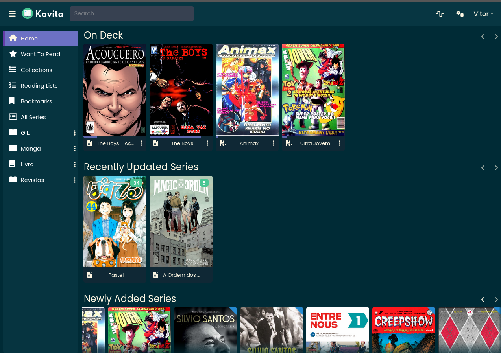
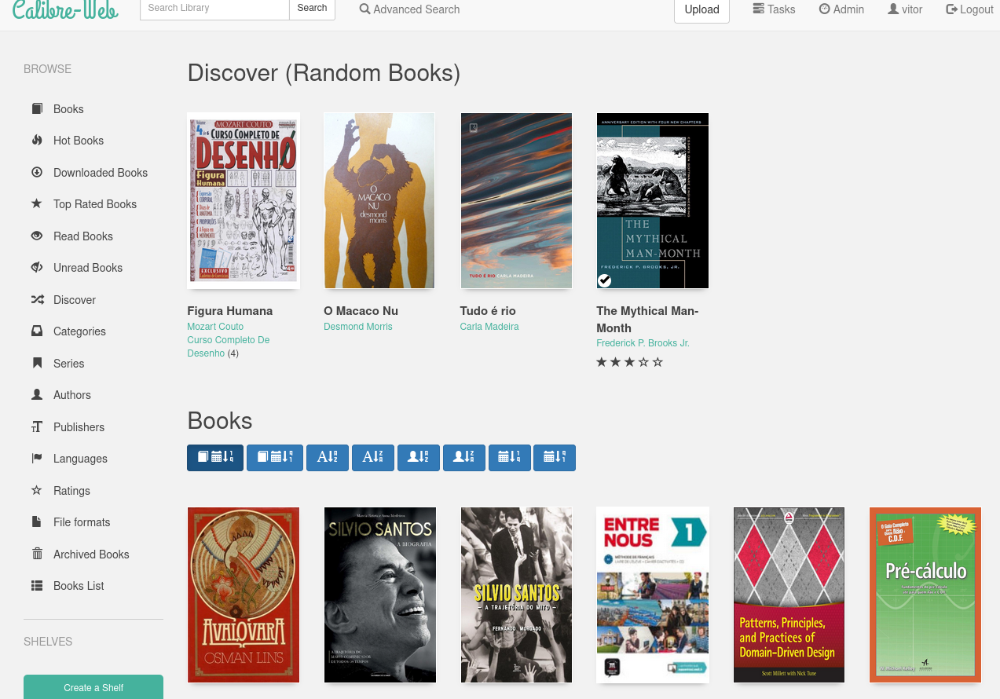

----

Hoje, separei um momento para catalogar todos os livros e quadrinhos físicos que tenho guardados em casa. Fiz isso principalmente porque a lista do que possuía estava, em grande parte, apenas na minha cabeça, dificultando o controle do que já comprei, do que já li e do que ainda preciso ler. Para resolver isso, eu usava o Goodreads, mas acabei abandonando. Agora, utilizo uma simples [lista do que li este ano e do que quero ler](leituras-de-2024), que resolve o problema até certo ponto.

O "será que já li?" é resolvido, embora eu ainda precise confiar na minha memória para leituras anteriores a 2023, já que não tenho esse registro anotado. Além disso, essa lista não ajuda a saber se já adquiri um determinado título. Por exemplo, atualmente estou lendo _Hokuto No Ken_, que tem 18 volumes, _Dragon Ball_, com 33 volumes, e _Berserk_, que não retomo há uns dois anos, tendo parado no volume 33.

É fácil cometer o erro de comprar um volume duplicado, o que já aconteceu comigo, mas felizmente não com frequência.

Então, criei uma planilha com todos os livros que possuo. No total, entre lidos e não lidos, são 309 títulos, e confesso que achei que teria menos. Estou tentando evitar acumular livros, especialmente morando de aluguel, onde o espaço é limitado.

Já pratiquei o desapego algumas vezes, doando mochilas cheias de livros para a biblioteca da minha região e vendendo alguns títulos pela Shopee, o que teve uma boa saída. No entanto, vender pode demorar semanas ou meses, então prefiro doar.

Catalogar tudo me fez perceber que certos títulos já não fazem tanto sentido para mim. Pelo menos não a ponto de mantê-los fisicamente, quando posso lê-los no Kindle ou tablet.

Na planilha, além das colunas "Título" e "Autor(es)", coloquei duas novas: "Lido?" e "Desfazer?". A coluna "Lido?" pode receber um ✔️ ou um 🔲, enquanto "Desfazer?" pode ter um 👍 ou 👎.

Percebi que posso despachar bons livros, como _A Lei_, de Frédéric Bastiat, e _A Última Tentação_, de Nikos Kazantzakis. São ótimos, mas posso reler no Kindle sem prejuízo. Já livros que recebi 👎, como _Blade - A Lâmina do Imortal_ e _Cálculo_, têm valor emocional ou oferecem uma experiência física que a tecnologia não consegue reproduzir.

Ainda restam dezenas de livros sem resposta definitiva, mas agora, com tudo organizado em uma planilha, fica mais fácil gerenciar a situação.

Falando em gerenciamento, já tenho um esquema interessante para organizar todas as minhas mídias de leitura (quadrinhos, mangás, livros) com softwares de código aberto. Se você também está pensando em organizar sua coleção digital, aqui vão algumas ferramentas gratuitas que podem ajudar: [Kavita](https://github.com/Kareadita/Kavita) (para organizar e ler bibliotecas de mangás, quadrinhos e livros), [Calibre](https://calibre-ebook.com/pt_BR) (para organizar e converter livros em PDF, MOBI, EPUB, etc.), e [Calibre-web](https://github.com/janeczku/calibre-web) (uma interface amigável que utiliza o Calibre "por trás dos panos"). Embora pareça que as três ferramentas fazem a mesma coisa, cada uma tem seus pontos fortes e fracos; eu uso todas.

Logo abaixo, um gostinho de como é a tela inicial do Kavita. Você pode organizar em bibliotecas. Repare que a minha tem "Gibi", "Mangá", "Livro" e "Revistas", cada um com conteúdo sobre esse tema.

Em seguida, a tela do meu Calibre-Web. Via de regra, eu utilizo ele apenas para os livros. Quadrinhos, mangás, etc., eu deixo no Kavita, que também mostra os mesmos livros que aparecem no Calibre-Web.

Minha ideia, aos poucos, é que, à medida que vou me desfazendo dos livros físicos, obtenho o equivalente digital e assim poderei relê-los sempre que quiser.