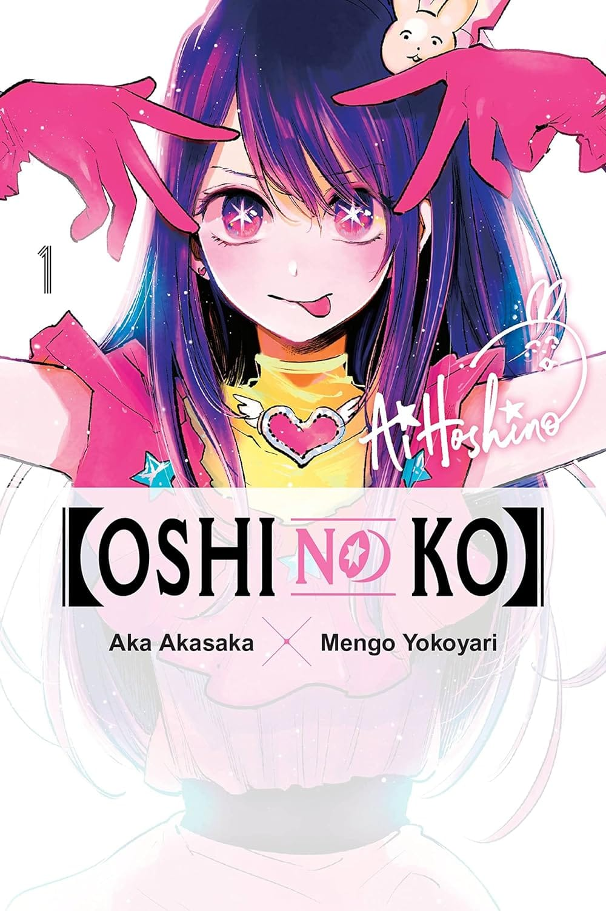

> “Nesta indústria, a mentira é uma arma.”Goro é um obstetra trabalhando em uma cidade do interior e sem qualquer ligação com a indústria do entretenimento. Por outro lado, Ai Hoshino, sua idol favorita, começava a subir no estrelato. Mas, por um acaso do destino, a vida de ambos será mudada radicalmente...?

Esse eu estava curioso depois de assistir ao ótimo anime lançado em 2023. A história retrata muito bem como a indústria da mídia funciona, onde a mentira e as aparências são o normal.

> Você pode sonhar com o mundo do entretenimento... mas é melhor não ficar alimentando ilusões sobre ele. Este não é um lugar de arte. Mas , sim, de negócios.

Não gostei muito da qualidade do papel; não achei especificações no volume e nem pesquisei, mas é algo parecido com papel jornal. Tive até a impressão de que vai amarelar rapidamente. Aqui e ali, há alguns erros de gramática também. A edição da _Panini_, afinal, não é lá essas coisas. Sobre a história, gostei, e vai ser interessante ver o jogo de manipulação nos próximos volumes.