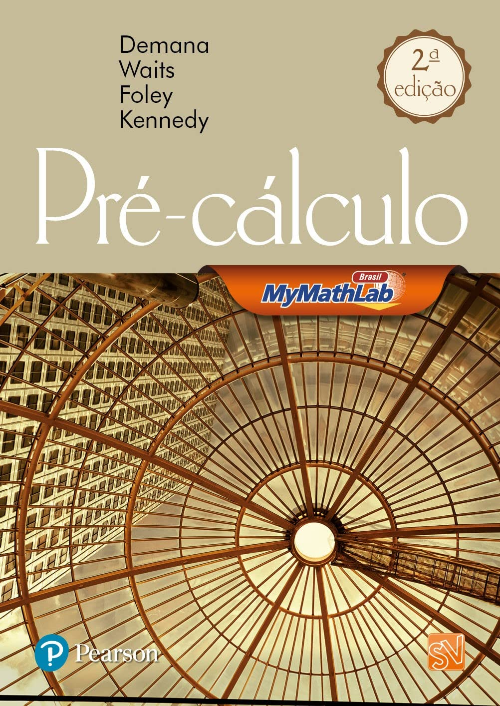

Decidi revisar meus conhecimentos em Cálculo e, para isso, optei por revisar minha base pré-cálculo primeiro. Já possuía este livro e constato sua qualidade. É conciso, com um número reduzido de páginas, mas oferece um ponto de partida sólido para revisão. No final aborda os capítulos sobre limites e derivadas de forma clara e direta resumidamente. Recomendo.