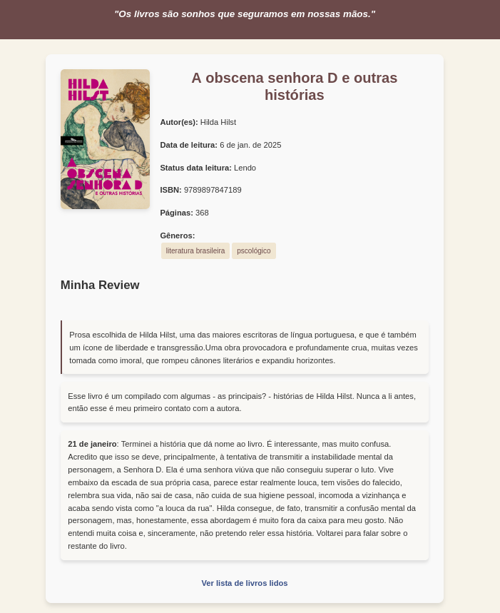
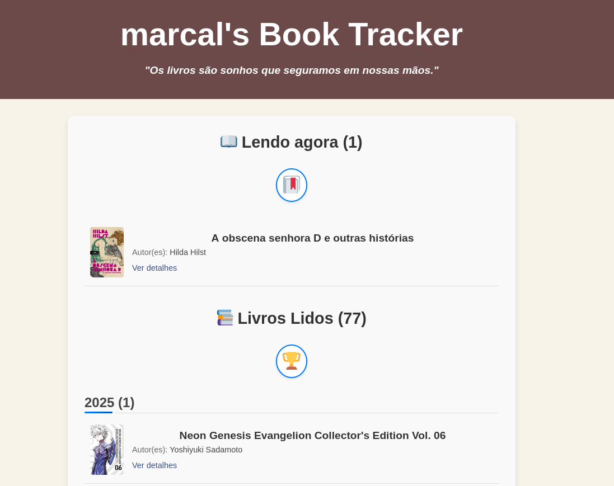

Eu já tinha comentado sobre a ideia de criar um **book tracker** pessoal separado deste blogue. Em [Ideias para Book Tracker Pessoal com Markdown](ideias-para-book-tracker-pessoal-com-markdown), expliquei melhor o que queria e até me empolguei um pouco, chegando a prototipar como seria o visual básico.

Nos últimos quinze dias, dediquei uma atenção especial a esse novo projeto. Depois de desenvolver algo bem básico e copiar as publicações sobre livros deste blogue para lá, acho que finalmente tenho uma versão 1.0 do meu **book tracker**.

Ele não é dinâmico como o Goodreads e, para ser sincero, funciona de forma bem parecida com este blogue. Eu edito as publicações em Markdown com a ajuda do Obsidian e as salvo no repositório do GitHub do projeto. Basicamente, meu **book tracker** é um blogue estático, assim como este aqui. Como já comentei antes, o aspecto social não me interessa muito, então não me incomoda o fato de não ser tão prático quanto um formulário do Goodreads.

Como mencionei, ele é essencialmente um blogue, mas com um visual que atende à finalidade de eu pesquisar o que li, quando li e o que pensei sobre determinado livro. Não pretendo incluir um RSS por enquanto já que o que eu publicar lá também será publicado aqui. 

Além disso, finalmente encontrei uma forma apropriada de registrar meus pensamentos sobre leituras em andamento. Imagine que posso passar um, dois meses lendo um livro, e durante esse período ter algo a dizer, opiniões a emitir, citações a guardar... Publicar isso "picado" em uma postagem no blogue seria um pouco estranho. Isso acabaria gerando spam no feed, já que cada atualização na "review" do livro seria enviada novamente para consumo via feed.

Agora, consigo manter as "reviews" sempre abertas lá no **book tracker**, atualizando-as conforme a leitura avança. Depois de finalizar a leitura, posso pegar o conteúdo consolidado e publicar aqui. Ainda estou refinando esse fluxo, pois há muito o que ajustar nesse processo, sem contar as melhorias que quero implementar no projeto.

Se você quiser conferir o [código do projeto no GitHub](https://github.com/vitormarcal/books.marcal.dev) e, quem sabe, copiar a ideia, fique à vontade! É bem simples de configurar e posso ajudar se precisar.

Então é isso! Voltarei a falar sobre o projeto assim que tiver atualizações interessantes. Até a próxima!