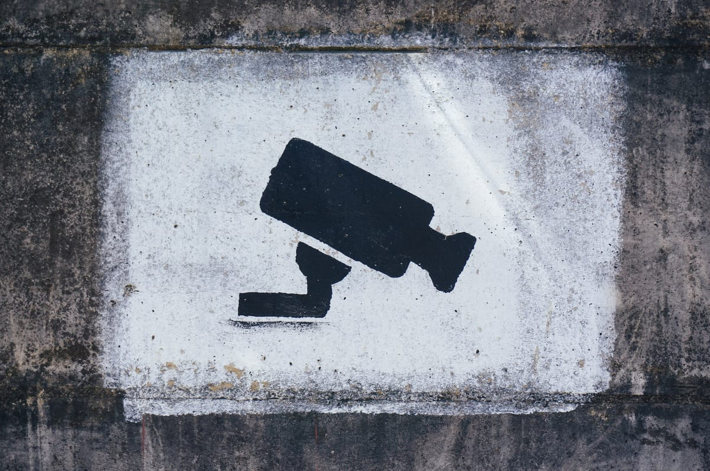

Photo by [Tobias Tullius](https://unsplash.com/@tobiastu?utm_source=ghost&utm_medium=referral&utm_campaign=api-credit) / [Unsplash](https://unsplash.com/?utm_source=ghost&utm_medium=referral&utm_campaign=api-credit)

Não diz respeito a ninguém. É algo seu, pessoal e privado. Seja qual for a atividade que esteja realizando, quer esteja apenas ocupado com tarefas normais, gerenciando suas contas mensais, preservando suas fotos de família preciosas ou desfrutando de um romance, você não deseja que isso seja exposto publicamente. Proteger sua privacidade é algo completamente aceitável.

O direito à privacidade é tão intrínseco quanto o direito de manter pensamentos privados. Você tem a liberdade de pensar o que quiser e não está obrigado a revelar esses pensamentos se assim não desejar. Tentar regulamentar isso parece tão absurdo que talvez não exista uma lei objetiva que afirme explicitamente: "Você tem o direito à liberdade de pensamento e não é obrigado a expô-lo." A privacidade, assim como a liberdade de pensamento, é um direito natural que precede qualquer organização ou estado.

Apenas porque não tenho nada a esconder, não deixaria a porta da minha casa aberta, sem chaves. Não permitiria que um desconhecido entrasse simplesmente para ver o que há lá, observar como eu ou minha família vivemos. Nem mesmo se alguém fosse um amigo, eu não o deixaria abrir meu celular e acessar meus dados ou minha conta bancária. Seja um estranho ou um amigo, não concedemos esse acesso total às nossas vidas. Então, por que permitiríamos que empresas como Google, Microsoft e Meta tivessem esse amplo e irrestrito acesso aos nossos dados?

Como mostrado no documentário "O Dilema das Redes", privacidade importa. Não que as grandes techs irão vender seus dados, mas sim porque registrarão e rastrearão suas informações para rotulá-lo, catalogá-lo e influenciá-lo de maneira a otimizar a monetização. Não é do interesse dessas empresas abrir ou vender diretamente seus dados a terceiros. O que estão vendendo é a habilidade de influenciar seus pensamentos e decisões de uma forma que normalmente você não teria normalmente.

Se eles perceberem que, por algum motivo, você está inclinado a comprar um determinado sapato, em termos gerais, eles farão com que você seja exposto a um aumento significativo de conteúdo relacionado, intercalado com publicidade. Você acabará consumindo tantos materiais desse tipo que, eventualmente, decidirá adquirir o referido sapato. Essa explicação de causa e efeito é bastante simplificada. Certamente, os algoritmos são altamente sofisticados e estão sendo constantemente aprimorados. Existe um investimento maciço para garantir que esse refinamento ocorra a cada momento.

Outro efeito da operação das redes é que ela nos condiciona a viver cada vez mais em bolhas: as plataformas não nos mostram necessariamente a verdade, mas sim o que potencialmente desejamos ver. Isso nos leva a um buraco de coelho sem fim, onde consumimos cada vez mais conteúdo relacionado e evitamos ser expostos a opiniões contraditórias. Surge uma falsa impressão de que todos pensam exatamente como nós, e se todos compartilham nossas opiniões, acreditamos estar do lado da verdade, do normal e do correto.

A tendência amplamente observada é o alinhamento aos extremos, onde cada lado acusa o outro de ser totalitário, violento e imoral. De fato, para os extremistas, estar no meio, ser rotulado como "isentão", acaba sendo considerado tão prejudicial quanto estar do lado oposto. A ausência de pontos de vista contraditórios, associada à vida em bolhas e à incapacidade de dialogar com pessoas de opiniões diferentes, representa uma ameaça à civilização democrática e baseada no Estado de Direito.

Sem dúvida, estamos caminhando em direção a uma era em que a ditadura dos extremos se torna proeminente, e corremos o risco de praticar uma auto-censura inconsciente. Essa dinâmica pode potencialmente levar ao colapso da civilização conforme a conhecemos.

E aí, a privacidade importa?