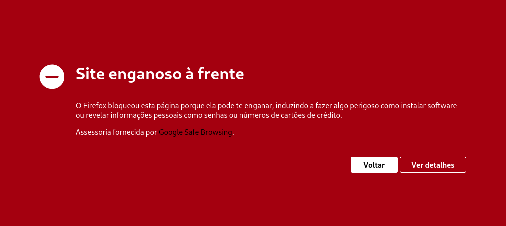

Qual não foi a minha surpresa ao tentar acessá-lo hoje e me deparar com um alerta vermelho! Não apenas o endereço do meu blog, mas todos os meus domínios em _marcal.dev_ estão com esse aviso.

Por exemplo, meu projeto ainda em desenvolvimento, [https://books.marcal.dev](https://books.marcal.dev), que eu nem sequer divulguei na internet — além de mencioná-lo aqui no blog —, também está marcado com esse alerta.

Ainda estou tentando entender o que aconteceu. Será que me confundiram com outro Marçal e denunciaram meu domínio para os buscadores? Ou será que algum outro Marçal (existem vários com sites por aí, inclusive outros Vítor Marçal) resolveu denunciar o meu? Vai saber...

O problema é que eu uso vários serviços de caráter pessoal para facilitar meu dia a dia no meu domínio, e agora, toda vez que tento acessá-los: BAM! Aparece o aviso de "site engano à frente".

Sacanagem, viu!