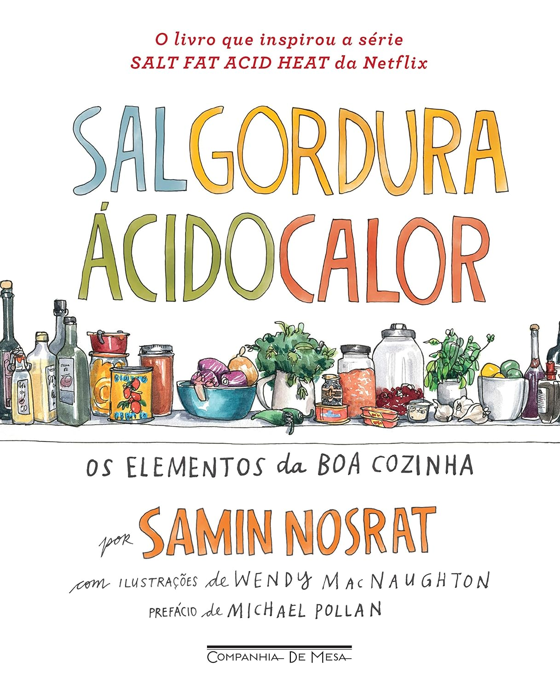

---

> A chef Samin Nosrat já ensinou muita gente a cozinhar, até mesmo o autor best-seller Michael Pollan. Isso porque ela segue uma filosofia simples, mas revolucionária: domine o uso de apenas quatro elementos e todo prato que você preparar ficará uma delícia!  
   Com cem receitas base e dezenas de variações, coloque em prática as lições para fazer vinagretes de dar água na boca, vegetais perfeitamente caramelizados, carnes assadas a ponto de desfazer e massas de torta leves e quebradiças.

Açúcar, tempero, tudo o que há de bom e, sem querer, um pouquinho do elemento X: esses foram os ingredientes que o Professor Utônio usou para criar as Meninas Superpoderosas. Tá bom, na realidade não é bem assim, não vamos criar algo como no desenho. Mas não é preciso ser o Professor Utônio para criar algo incrível na cozinha. E é isso que "Sal, Gordura, Ácido, Calor: Os Elementos da Boa Cozinha" tenta nos passar com seu texto simples e belos desenhos.

O momento em que Professor Utônio criou as Meninas Superpoderosas

Segundo o livro, um bom preparo pode ser resumido em quatro elementos: sal, gordura, ácido, calor. É explicado o papel de cada um desses elementos na cozinha, como, por exemplo, o do sal, que age como um amplificador de sabores em um prato.

Adequadamente usado, minimiza o amargor, equilibra a doçura e faz sobressair os aromas. Inclusive, segundo o livro, o sal tem um impacto maior sobre o sabor do que qualquer outro ingrediente. Isso não significa que devemos usar mais sal, mas sim que devemos usar **melhor** o sal, adicionando-o na quantidade, na hora e na forma certas.

É um livro que não dá pra ler em uma sentada. Não é necessário ler de forma linear; portanto, é mais um livro de consultas. Além da teoria, o livro cobre uma boa parte com receitas, de modo que dá para aplicar o que foi aprendido antes. Vale o investimento e irei consultá-lo mais vezes com certeza.