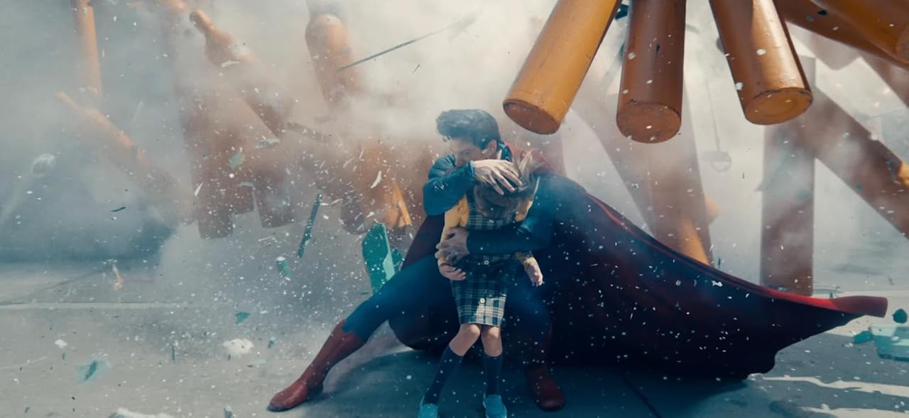
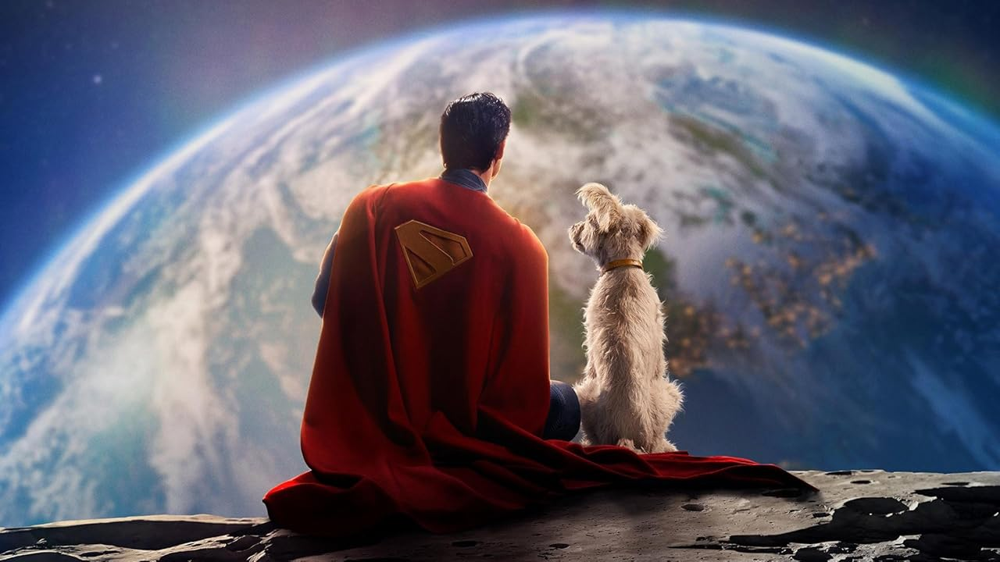

Acredito que heróis não devem confundir, não devem estar na zona cinzenta da moralidade, eles representam tudo o que poderíamos ser, mesmo sem seus poderes.

Esse Superman tem uma preocupação genuína não só com as pessoas, mas mesmo um esquilo, que pode acabar sendo esmagado, até o inimigo que está batalhando contra.

Uma volta à origem era o que precisávamos e foi o que conseguimos com esse novo Superman. 

A meu ver ele agora se torna o melhor Superman adaptado nos cinemas.

