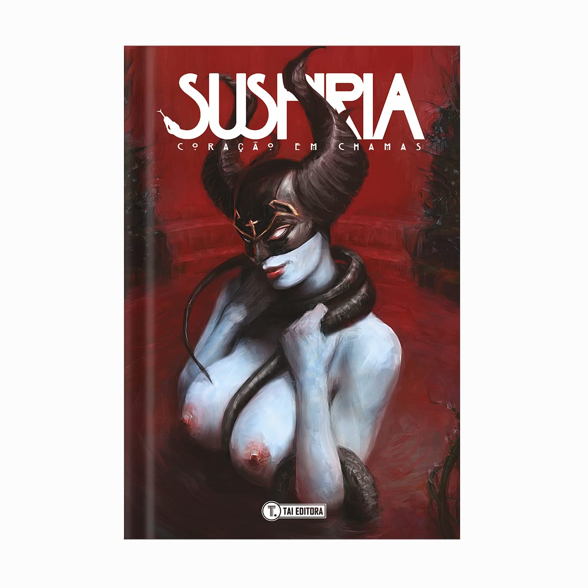
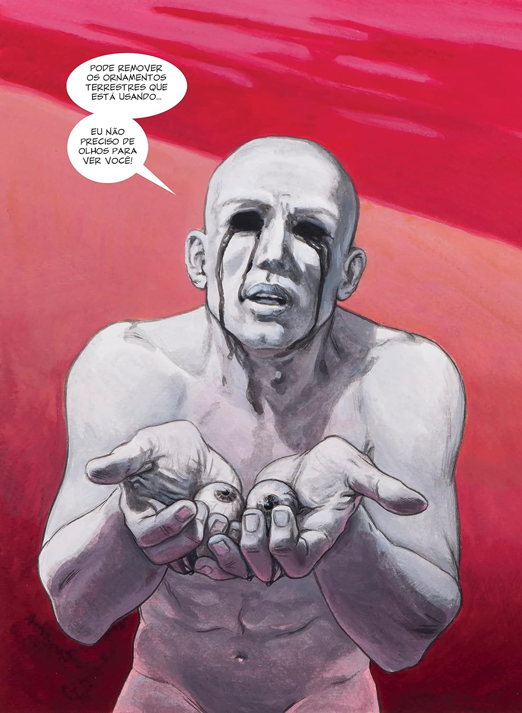

> Suspiria é a personificação onipresente do medo e do desespero. Ela perambula pela Terra desde o início dos tempos, caçando e punindo almas que não conseguem se livrar do próprio destino por pura indolência. Suspiria está sempre na companhia da sua mãe Santa Morte e das suas três irmãs: Nenia Candelaria, Sudaria e Grimoria. Elas são as Deusas das Trevas, as consoladoras da paz eterna. Uma fúria infernal ungida do Reino das Trevas, região situada nas profundezas do planeta, uma força cosmológica universal suspensa no tempo eterno por onde essa tétrade infernal se move entre os séculos de história da humanidade. Um verdadeiro asilo do universo.

A melhor definição foi de um comentário que vi na internet: Suspiria é erotismo, é filosofia e psicanálise.

Menção honrosa à receita de sabão feita com gordura humana 🫣
Continuo recomendando!