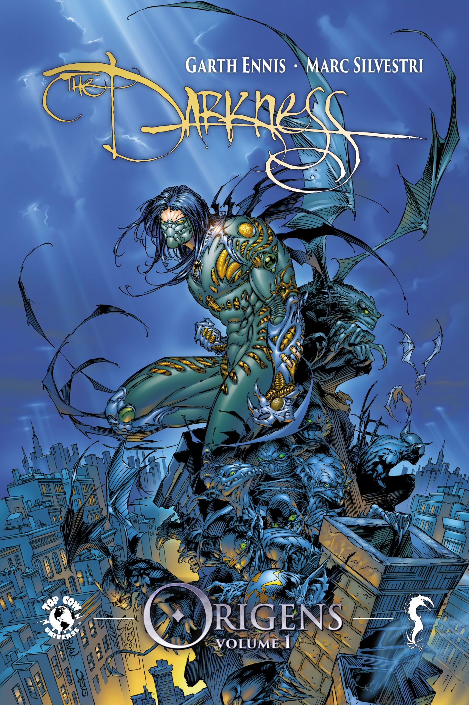

> O submundo do crime da cidade de Nova York é um lugar sombrio e brutal, mas nunca viu um horror como este…do aclamado escritor Garth Ennis e do atual CEO da Image Comics, Marc Silvestri conheça o maior prodígio dos assassinos da máfia italiana: Jackie Estacado.
   Em seu aniversário de 21 anos o jovem mafioso Jackie Estacado descobre que possui uma herança poderosa e que passa de geração em geração. Ele é o herdeiro da Escuridão e agora vai ter que lidar com diversos inimigos que desejam este poder para si!

Não conhecia Darkness, o que eu sabia era que era uma espécie de Batman da editora Image. 

Olhando pela história, esse é um produto dos anos 90: Violência, roteiro não muito inteligente, homens explodindo testosterona, mulheres-super-sensuais-malhadas-em-corpos-irreais. Pessoalmente, eu adorei! 