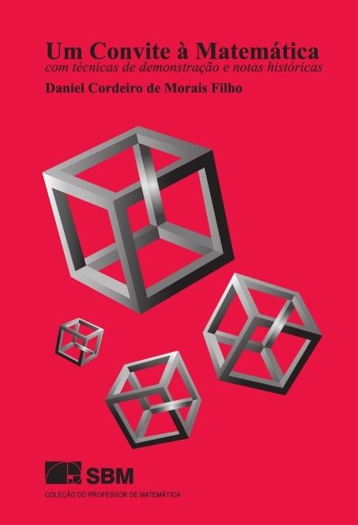

> Como se estruturam a lógica, os teoremas e as conjecturas matemáticas? As bases desse admirável universo são explicadas nesta obra. O autor apresenta os fundamentos básicos da lógica matemática e explica como as ideias nesse campo do conhecimento funcionam. O livro permite aos alunos do último ano do ensino médio e aos que ingressaram no primeiro ano das universidades terem um contato mais sólido com o formalismo e a abstração necessários para tornar inteligível algumas das primeiras disciplinas da matemática.
> O raciocínio lógico dedutivo é fundamental para os estudantes de matemática. Na busca de desenvolvê-lo, num curto intervalo de tempo, o autor coloca os leitores em contato com as notações mais utilizadas, sentenças, a definição e demonstração de teoremas, modelos axiomáticos e convenções matemáticas, conjecturas e problemas famosos, o princípio de indução, os números de Fermat, primos gêmeos, resumo e tabela-resumo das técnicas de demonstração, além de muitas curiosidades.

É um bom material, principalmente porque oferece ótimos contextos históricos, curiosidades, etc. Aprender técnicas de demonstração é extremamente interessante e muito importante para assimilar novos conceitos de matemática, desenvolver o pensamento crítico na resolução de problemas e evitar depender apenas da memorização.

Eu gostei muito!