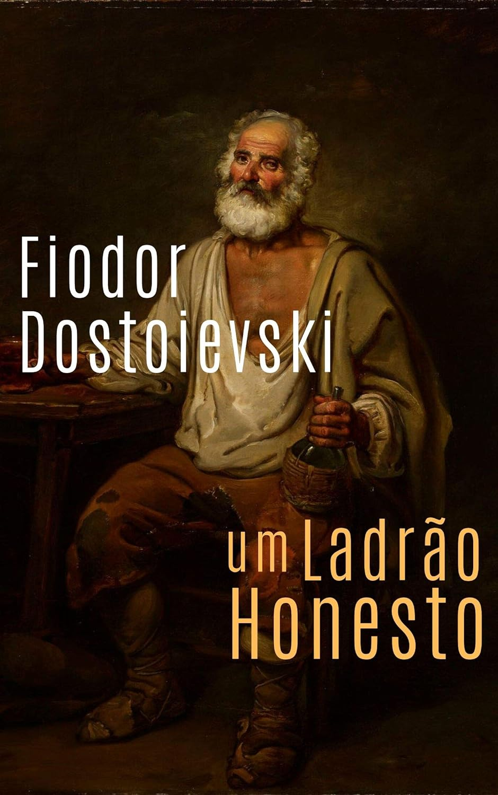

---

Já vem um tempo que quero consumir mais Fiodor Dostoievski e saber se realmente é isso tudo que dizem por aí. Minha primeira leitura, o livro Noites Brancas, me marcou bastante e dizem que é um livro com um estilo atípico do que se tem do mesmo autor. É até mesmo uma história breve. Normalmente, seus livros são calhamaços, portanto assim como o romance Noites Brancas, a leitura de contos costuma ser uma boa introdução a o autor. Dessa vez escolhi o conto Um Ladrão Honesto.

No decorrer da leitura, destaquei uma citação muito verdadeira que não pode ser esquecida jamais:

> Ao meu ver, não há um verme pior no mundo do que um ladrão. Outros podem levar algo de graça, mas um ladrão rouba o trabalho das suas mãos, o suor da sua testa, o seu tempo...

Seja o ladrão moderno de galinhas (um ladrão de celular), um funcionário público corrupto, um político desviando verbas, um comunista ou um fascista, todos, de uma maneira ou de outra, são ladrões que usurpam o fruto do nosso trabalho, o esforço dedicado e nosso bem mais valioso: o tempo. Cada bem conquistado representa horas de trabalho, distante da família, do descanso, com sacrifícios significativos. Aquele que rouba horas de trabalho, rouba tempo de vida, de modo que aquele que rouba alguém rouba sua liberdade!

Registro isso ao notar que o brasileiro médio trabalha quase 5 meses para pagar impostos e que, no [site impostometro](https://impostometro.com.br/), na data de hoje, registra 2.93 trilhões de impostos retirados da população. Por muito menos, houve a inconfidência mineira e toda a história envolvendo Tiradentes.

Voltando ao conto, sinto que acabei lendo este conto rápido de mais, de modo que talvez eu o releia novamente. É uma boa história que ilustra a importância da humildade, reconhecer seus erros e também a importância de conceder o perdão.
